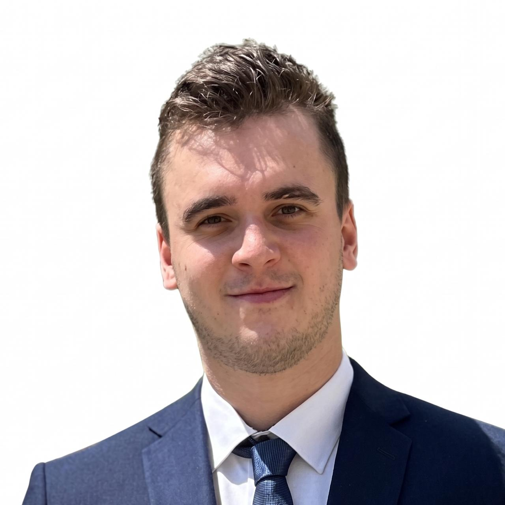
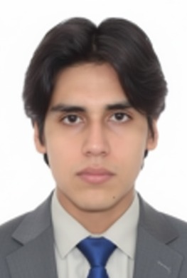
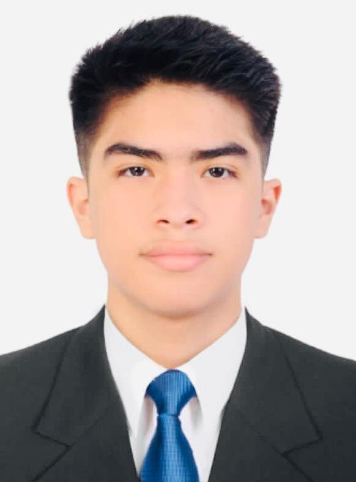

# Chapter I: Introduction

## 1.1. Startup Profile

### 1.1.1. Startup Description

CryoVigil is a technology startup focused on digital transformation, operational security, and traceability in the
bioclinical and pharmaceutical sectors. Our organization resolves a dual vulnerability in the healthcare industry:
the loss of viability of sensitive biological materials due to cold chain failures, and the misplacement or incorrect
storage of critical samples within facilities. As an emerging company, we build software infrastructures that safeguard
the quality of medical diagnostics and optimize the internal logistics of laboratories.

The core of our value proposition is a comprehensive SaaS (Software as a Service) platform oriented exclusively to the
application layer. CryoVigil processes temperature data and RFID telemetry to offer real-time environmental and
location monitoring. Through our SPA (Single Page Application) Dashboard, we replace manual supervision with predictive
and automated surveillance. The platform allows clinical and technical staff to configure threshold alerts, validate
whether a sample has been deposited in the correct compartment according to its thermal requirements, and generate
regulatory audit reports with a single click.

Our B2B business model democratizes access to corporate-grade technology for medium-sized laboratories and clinics,
focusing on a hardware-agnostic architecture that prioritizes usability and information immediacy over hardware
technical complexities.

### 1.1.2. Team member Profiles

<table>
	<thead>
		<tr>
			<th>Photo</th>
			<th>Name</th>
			<th>Code</th>
			<th>Program</th>
			<th>Description</th>
		</tr>
	</thead>
	<tbody>
		<tr>
			<td></td>
			<td>Arizabal Condori, Jean Niels</td>
			<td>U201919096</td>
			<td>Software Engineering</td>
			<td>I am a Software Engineering student, I'm mainly interested in low level programming, particularly in systems programming and embedded systems. </td>
		</tr>
		<tr>
			<td></td>
			<td>Homola, Tomas</td>
			<td>U202623624</td>
			<td>Software Engineering</td>
			<td>I am a Software Engineering student at Masaryk University in the Czech Republic, currently on an exchange program at the Peruvian University of Applied Sciences (UPC) for the semester. I am interested in software product development across various fields, particularly in the medical sector and the application of Artificial Intelligence for image recognition. I also enjoy developing my own applications, aiming to continuously improve my skills in requirements elicitation, analysis, and management. Within the team, I seek to contribute my expertise in both requirements definition and user interface (UI) design, thereby strengthening my teamwork skills and helping ensure the project's success.</td>
		</tr>
		<tr>
			<td></td>
			<td>Linares Rodriguez, Franco Orlando</td>
			<td>U20241B645</td>
			<td>Software Engineering</td>
			<td>I am Franco Linares, a fifth-semester Software Engineering student. From the moment I chose my major, I knew I had made the right decision. Over the past three years, I have discovered my passion for programming—specifically in C++, the language I have focused on developing my skills in throughout my studies. I also have basic knowledge of HTML5, CSS3, and JavaScript, as well as experience with database query languages ​​like SQL. I consider myself respectful, supportive, hardworking, and a strong team player.</td>
		</tr>
		<tr>
			<td></td>
			<td>Padilla Merino, Mauricio Jared</td>
			<td>U201911393</td>
			<td>Software Engineering</td>
			<td>I am a Software Engineering student currently in my fifth semester. I consider myself a dedicated individual who adapts easily to different teams and working styles. I focus on organizing project scope and delegating tasks to achieve our goals in the most efficient way possible.</td>
		</tr>
		<tr>
			<td></td>
			<td>Reyes Munoz, Joaquin Leonardo</td>
			<td>u202423262</td>
			<td>Software Engineering</td>
			<td>I consider myself a very patient, responsible, and dedicated person. I enjoy learning new things, solving problems, and working with others. I am always willing to improve my skills and face new challenges.</td>
		</tr>
	</tbody>
</table>
