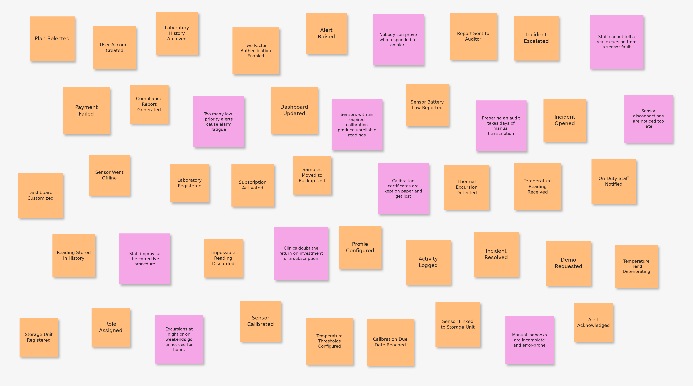

## 2.4. Big Picture EventStorming

The team carried out a **Big Picture EventStorming** session with the goal of obtaining a holistic and shared view of the **CryoVigil** domain. Unlike a detailed technical analysis, this process focused on mapping the business landscape, identifying the most significant domain events from the moment a clinic subscribes to the platform and a sensor sends its first reading, until a thermal excursion is resolved and documented in a compliance report.

During this phase, the team prioritized exploring the clinical workflow and the critical points of contact between laboratory staff and the technological infrastructure. The process was divided into the following stages:

* **Identification of Domain Events (Orange):** all relevant state changes of the business were captured in past tense, using a common language free of excessive technical terms (for example, the detection of a thermal excursion or the acknowledgment of an alert).

* **Detection of Pain Points (Pink):** at the same time, the team identified bottlenecks, operational risks and gaps in manual supervision, such as excursions that go unnoticed during nights and weekends, alarm fatigue caused by low-priority notifications, the lack of evidence about who responded to an alert, and the days of manual transcription needed to prepare an audit.

This first visual approximation allowed the team to expose improvement opportunities, such as anticipating excursions through trend analysis and replacing manual logbooks with an automatic and verifiable activity history, and laid the foundations to define the bounded contexts of the solution, ensuring that the proposed software architecture responds to the critical needs of bioclinical safety.

Diagram elaborated in Lucidchart.