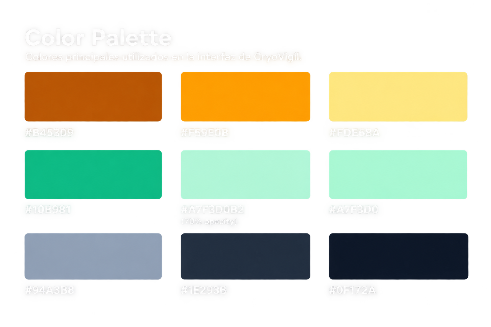
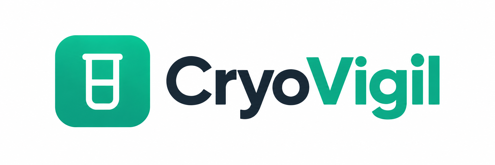

# Chapter IV: Product Design

## 4.1. Style Guidelines

En esta sección se presentan los estándares que definen el formato y el diseño de la solución, asegurando la calidad en su implementación.

### 4.1.1. General Style Guidelines

La paleta de colores seleccionada para CryoVigil ha sido definida considerando principios de psicología del color, con el objetivo de transmitir seguridad, confianza, precisión y control, características fundamentales para una plataforma orientada al monitoreo de laboratorios en tiempo real. El verde turqués funciona como color principal debido a su asociación con la seguridad, estabilidad, equilibrio y confianza. Por ello, se utiliza en los botones principales, elementos interactivos y estados positivos, reforzando la percepción de un sistema confiable y bajo control.

El verde se utiliza principalmente para representar estados normales, activos, resueltos y acciones principales, mientras que el rojo identifica alertas críticas que requieren atención inmediata. El amarillo/naranja representa advertencias o situaciones que requieren supervisión. Por otro lado, el azul se emplea para información y elementos complementarios. Los tonos blancos y grises claros conforman la base de la interfaz, proporcionando una apariencia limpia y facilitando la lectura de la información.

**Tipografia**

La tipografía seleccionada para CryoVigil es Plus Jakarta Sans, una fuente sans-serif moderna que se caracteriza por su apariencia limpia, equilibrada y profesional. Su diseño permite mantener una adecuada legibilidad en diferentes tamaños, facilitando la visualización de información relacionada con laboratorios, sensores, métricas y alertas dentro de la plataforma.

Para establecer una jerarquía visual clara, se utilizan diferentes pesos tipográficos de Plus Jakarta Sans según la función del contenido:

- Regular: utilizado para descripciones, textos informativos y contenido secundario.
- Medium: utilizado en etiquetas, opciones de navegación, filtros y elementos de apoyo.
- Semi Bold: utilizado en nombres de laboratorios, títulos de secciones y componentes que requieren mayor énfasis.
- Bold: utilizado en títulos principales, valores destacados, métricas y elementos de mayor jerarquía visual.

**Brading**

El nombre CryoVigil representa la identidad de la plataforma y hace referencia a la supervisión continua de las condiciones de los laboratorios. El branding utiliza un isotipo relacionado con un contenedor o elemento de laboratorio, acompañado del nombre CryoVigil.

La identidad visual emplea principalmente el verde turquesa como color representativo, asociado con seguridad, tecnología y confiabilidad. Este color se mantiene de manera consistente en elementos como el logotipo, botones principales, estados activos e indicadores de funcionamiento.

### 4.1.2. Web Style Guidelines

 
