## **4.6. Domain-Driven Software Architecture**

This section builds on the Big Picture EventStorming presented in section 2.4 and takes it down to a design level following Domain-Driven Design, until the bounded contexts, aggregates, events, commands and queries of **CryoVigil** are identified. It then presents the software architecture of the solution using the C4 Model in Structurizr, through the Software Architecture Context Diagram, the Software Architecture Container Diagram and the Software Architecture Component Diagrams.

### **4.6.1. Design-Level Event Storming**

At this stage, the team carried out a detailed technical immersion to refine the workflow of **CryoVigil**. Unlike the previous stage, the *Design-Level EventStorming* made it possible to identify not only what happens in the system (**Domain Events**), but also who starts each action (**Actors** and **External Systems**), the intention behind it (**Commands**), the rules that govern the behavior of the software (**Policies**), the information users consult (**Read Models**) and the consistency boundaries that process each command (**Aggregates**).

During a focused design session, the elements were organized following the subdomains of a SaaS platform for laboratory cold chain monitoring. The result is a model of eight bounded contexts: three core contexts that deliver CryoVigil's value proposition by combining thermal telemetry with RFID location traceability, two supporting contexts that sustain the laboratory operation and its regulatory obligations, and three generic contexts common to any SaaS platform. The contexts collaborate through domain events, so each one keeps its own model and ubiquitous language while taking part in end-to-end flows such as detecting a thermal excursion, alerting the on-duty staff and recording the corrective action for audits.

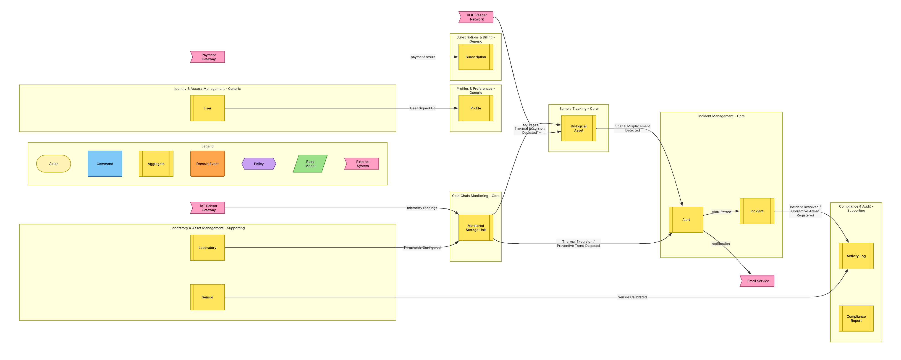
Diagram elaborated in Lucidchart.

### Explanation of the Identified Bounded Contexts

The eight bounded contexts that make up the architecture of the solution are described below:

#### 1. Identity & Access Management (Generic)

Manages who can enter CryoVigil and what each user is allowed to do. Its **User** aggregate processes commands such as Sign Up, Sign In, Enable Two-Factor Authentication, Assign Role and Deactivate Account, emitting events like User Signed Up and Role Assigned. A policy locks any session that stays idle past the timeout, and the Active Sessions read model supports the review of logins for security purposes. Its User Signed Up event triggers the creation of the user's profile in Profiles & Preferences.

| Element | Identified in this context |
|---|---|
| Aggregates | User |
| Commands | Sign Up, Sign In, Enable Two-Factor Authentication, Assign Role, Deactivate Account, Lock Session |
| Domain Events | User Signed Up, User Signed In, Two-Factor Authentication Enabled, Role Assigned, Account Deactivated, Session Locked |
| Queries (Read Models) | Active Sessions |
| Policies | Whenever a session stays idle past the timeout, lock the session |
| Actors / External Systems | Visitor, Lab Personnel, Lab Administrator |

*Related user stories: US04, US31, US32, US40, US41, US42, US43, US45, US46, US48.*

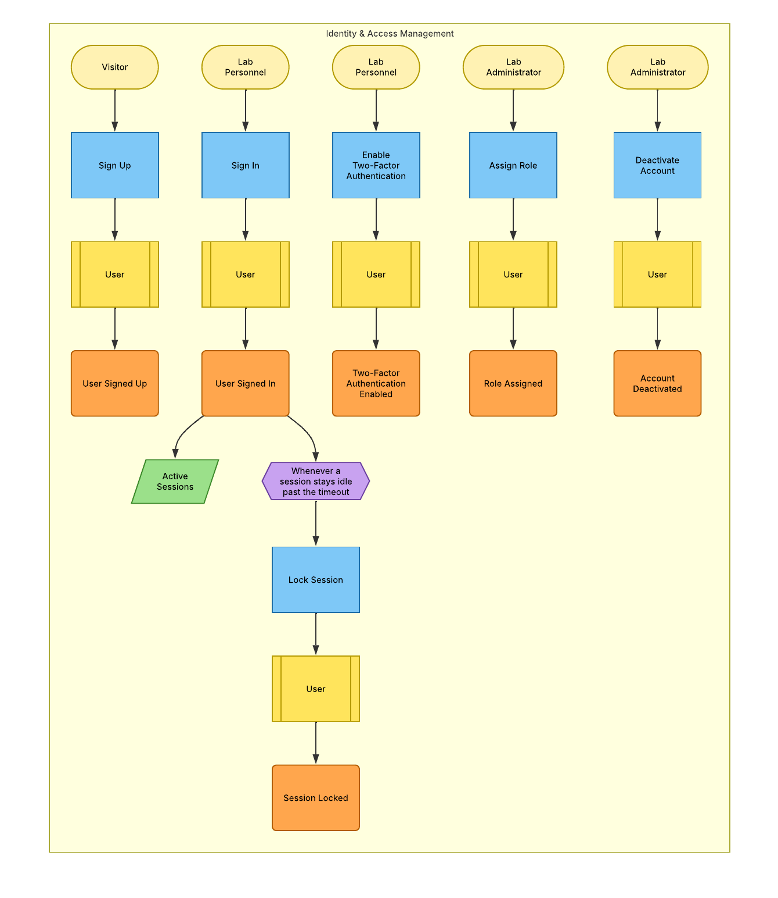
Diagram elaborated in Lucidchart.

#### 2. Profiles & Preferences (Generic)

Stores how each user prefers to work with the platform. When Identity & Access Management reports that a user signed up, a policy creates a default **Profile**. From then on, users update their personal data, switch the interface language between English (en-US) and Spanish (es-419), configure their alert channels and customize their dashboard layout. Each change emits an event, such as Language Changed or Notification Preferences Updated, that refreshes the User Preferences read model used by the rest of the application.

| Element | Identified in this context |
|---|---|
| Aggregates | Profile |
| Commands | Create Profile, Update Profile, Change Language (en-US / es-419), Configure Notification Channels, Customize Dashboard Layout |
| Domain Events | Profile Created, Profile Updated, Language Changed, Notification Preferences Updated, Dashboard Layout Customized |
| Queries (Read Models) | User Preferences |
| Policies | Whenever a user signs up (User Signed Up, from Identity & Access Management), create a default profile |
| Actors / External Systems | Lab Personnel |

*Related user stories: US30, US36, US38, US44, US47, US50.*

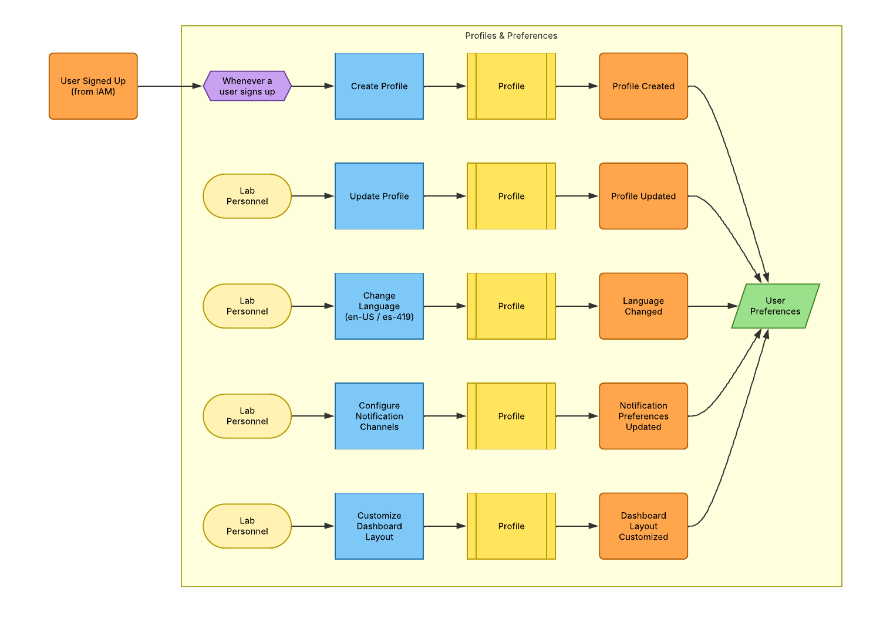
Diagram elaborated in Lucidchart.

#### 3. Subscriptions & Billing (Generic)

Handles the commercial relationship between CryoVigil and each laboratory. Visitors consult the Plan Catalog and select a plan according to the volume of assets they need to protect. Laboratory administrators then subscribe, and a policy sends the payment request to the external Payment Gateway. The gateway's response either confirms the payment and activates the **Subscription**, or registers a failed payment that, by policy, suspends it. Administrators can also cancel their subscription at any time.

| Element | Identified in this context |
|---|---|
| Aggregates | Subscription |
| Commands | Select Plan, Subscribe, Request Payment, Confirm Payment, Register Failed Payment, Suspend Subscription, Cancel Subscription |
| Domain Events | Plan Selected, Subscription Requested, Subscription Activated, Payment Failed, Subscription Suspended, Subscription Cancelled |
| Queries (Read Models) | Plan Catalog |
| Policies | Whenever a subscription is requested, request the payment; whenever a payment fails, suspend the subscription |
| Actors / External Systems | Visitor, Lab Administrator, Payment Gateway |

*Related user stories: US02.*

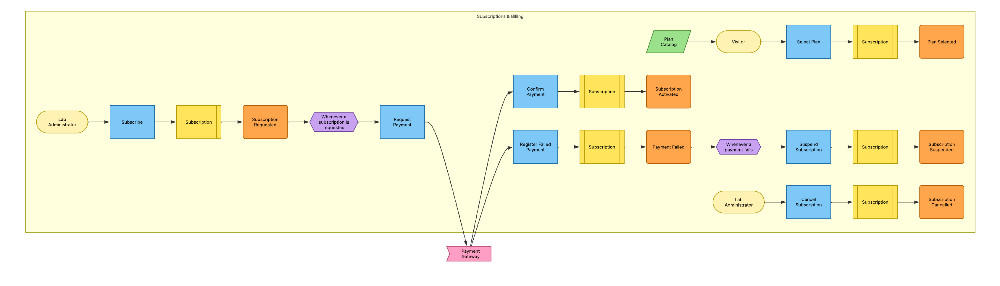
Diagram elaborated in Lucidchart.

#### 4. Laboratory & Asset Management (Supporting)

Models the physical infrastructure that CryoVigil protects. Through the **Laboratory** and **Sensor** aggregates, technical staff register laboratories and their storage units, configure the safe temperature thresholds of each unit, link sensors to them and record sensor calibrations. A daily policy flags every sensor whose calibration is due. Its events feed other contexts: Storage Unit Registered, Sensor Linked and Thresholds Configured keep Cold Chain Monitoring up to date, and Sensor Calibrated is logged by Compliance & Audit. The Laboratory Directory read model supports searching and filtering laboratories.

| Element | Identified in this context |
|---|---|
| Aggregates | Laboratory, Sensor |
| Commands | Register Laboratory, Register Storage Unit, Configure Temperature Thresholds, Link Sensor to Storage Unit, Calibrate Sensor, Flag Calibration Due |
| Domain Events | Laboratory Registered, Storage Unit Registered, Thresholds Configured, Sensor Linked, Sensor Calibrated, Calibration Due Flagged |
| Queries (Read Models) | Laboratory Directory |
| Policies | Every day, whenever a sensor calibration is due, flag the sensor |
| Actors / External Systems | Technical Staff |

*Related user stories: US11, US12, US13, US14, US20, US21, US29, US33.*

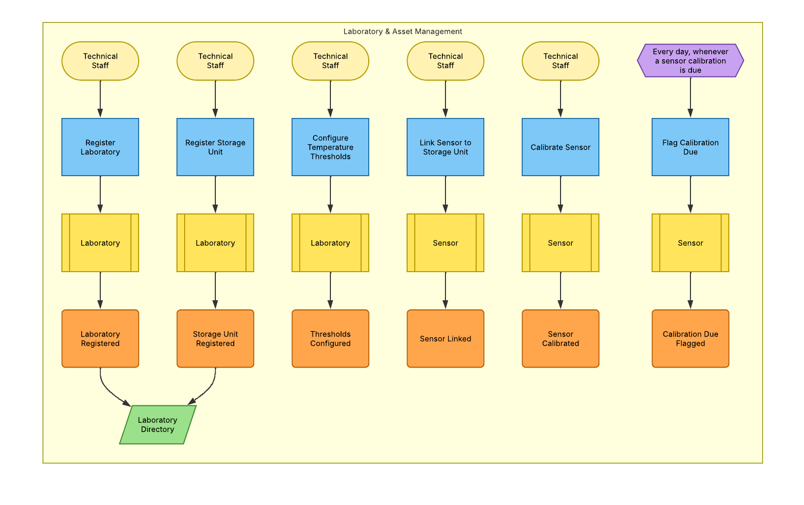
Diagram elaborated in Lucidchart.

#### 5. Cold Chain Monitoring (Core)

The ingestion and analysis core of the platform. The external IoT Sensor Gateway sends telemetry readings that the **Monitored Storage Unit** aggregate records and evaluates against its safe thresholds. Policies decide what each reading means: a value outside the thresholds registers a Thermal Excursion, a deteriorating trend registers a Preventive Trend, and readings back within range normalize the thermal status. Other policies keep this context aligned with Laboratory & Asset Management by creating a monitored unit for every new storage unit, mapping newly linked sensors and updating the thresholds. The readings feed the Real-Time Thermal Dashboard, Historical Temperature Trends and Thermal Heatmap read models, while its detection events are consumed by Sample Tracking and Incident Management.

| Element | Identified in this context |
|---|---|
| Aggregates | Monitored Storage Unit |
| Commands | Record Telemetry Reading, Register Thermal Excursion, Register Deterioration Trend, Normalize Thermal Status, Update Monitoring Thresholds, Create Monitored Unit, Map Sensor |
| Domain Events | Telemetry Reading Recorded, Thermal Excursion Detected, Preventive Trend Detected, Thermal Status Normalized, Monitoring Thresholds Updated, Monitored Unit Created, Sensor Mapped |
| Queries (Read Models) | Real-Time Thermal Dashboard, Historical Temperature Trends, Thermal Heatmap |
| Policies | Whenever a reading is outside the thresholds, register a thermal excursion; whenever the trend approaches a threshold, register a deterioration trend; whenever readings return within the thresholds, normalize the thermal status; whenever thresholds change, a storage unit is registered or a sensor is linked (from Laboratory & Asset Management), update the monitored unit |
| Actors / External Systems | IoT Sensor Gateway |

*Related user stories: US05, US06, US07, US10, US24, US37.*

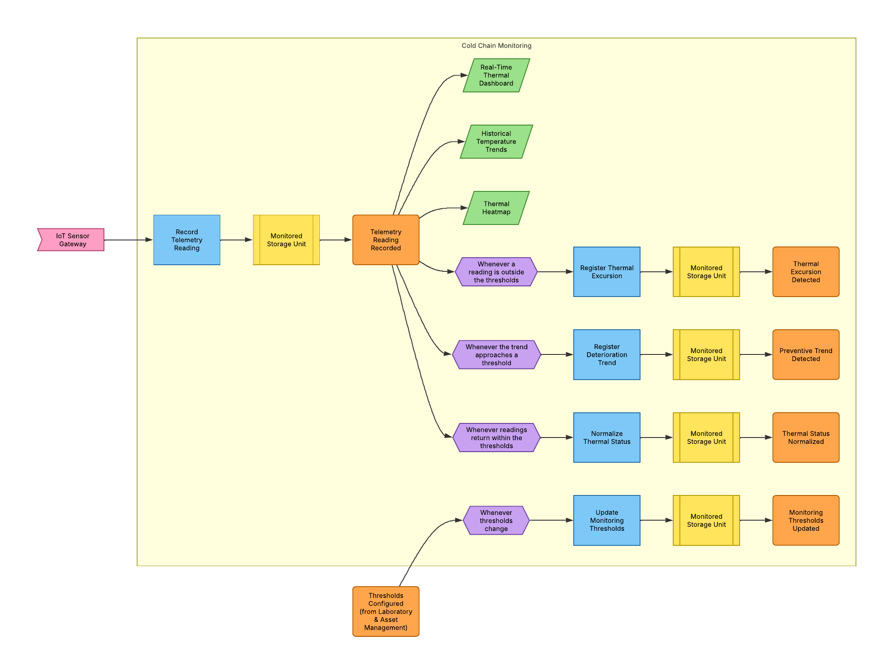
Diagram elaborated in Lucidchart.

#### 6. Dashboard & Analytics (Supporting)

Manages the main dashboard of the web application, turning the data produced by other contexts into the views users rely on to supervise the cold chain at a glance. Each user has a **Dashboard** aggregate, created by default when the user signs up, where they add, rearrange (drag, resize and reorder) and remove widgets, change the time range of the charts and reset the layout. This context does not generate operational data: it projects the events published by Cold Chain Monitoring and Incident Management into the Real-Time Thermal Overview, Historical Temperature Trends, Thermal Heatmap, Recent Critical Alerts and Operational KPIs read models. From the Recent Critical Alerts widget, laboratory personnel can acknowledge an alert directly, a command that is executed by Incident Management.

| Element | Identified in this context |
|---|---|
| Aggregates | Dashboard |
| Commands | Create Default Dashboard, Add Widget, Rearrange Widgets, Remove Widget, Change Time Range, Reset Dashboard Layout |
| Domain Events | Default Dashboard Created, Widget Added, Widgets Rearranged, Widget Removed, Time Range Changed, Dashboard Layout Reset |
| Queries (Read Models) | User Dashboard Layout, Real-Time Thermal Overview, Historical Temperature Trends, Thermal Heatmap, Recent Critical Alerts, Operational KPIs |
| Policies | Whenever a user signs up (User Signed Up, from Identity & Access Management), create a default dashboard |
| Events Consumed | Telemetry Reading Recorded and Thermal Excursion Detected (from Cold Chain Monitoring); Alert Raised, Alert Acknowledged and Incident Resolved (from Incident Management) |
| Actors / External Systems | Lab Personnel, Technical Staff |

*Related user stories: US05, US06, US07, US08, US09, US37, US47.*

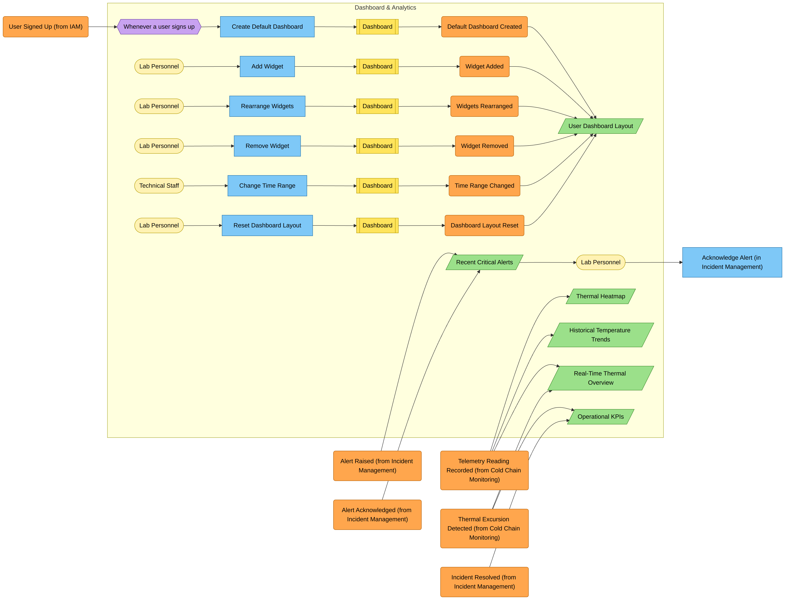
Diagram elaborated in Lucidchart.

#### 7. Incident Management (Core)

Turns detected risks into coordinated human action. Whenever Cold Chain Monitoring or Sample Tracking reports a thermal excursion, a preventive trend, a spatial misplacement or an exposed asset, a policy raises an **Alert** and another notifies the on-duty staff through the external Email Service. For critical alerts, a policy opens an **Incident**. Staff acknowledge alerts and register corrective actions until the incident is resolved, while an escalation policy handles alerts that remain unacknowledged past the time limit. The Alert Feed and Incident History read models support filtering and follow-up.

| Element | Identified in this context |
|---|---|
| Aggregates | Alert, Incident |
| Commands | Raise Alert, Notify On-Duty Staff, Acknowledge Alert, Open Incident, Escalate Incident, Register Corrective Action, Resolve Incident |
| Domain Events | Alert Raised, Alert Acknowledged, Incident Opened, Incident Escalated, Corrective Action Registered, Incident Resolved |
| Queries (Read Models) | Alert Feed (filterable), Incident History |
| Policies | Whenever a risk is detected, raise an alert; whenever an alert is raised, notify the on-duty staff; whenever a critical alert is raised, open an incident; whenever an alert stays unacknowledged past the time limit, escalate the incident |
| Actors / External Systems | Lab Personnel, Technical Staff, Email Service |

*Related user stories: US08, US09, US17, US18, US25, US26, US27, US34, US35, US39.*

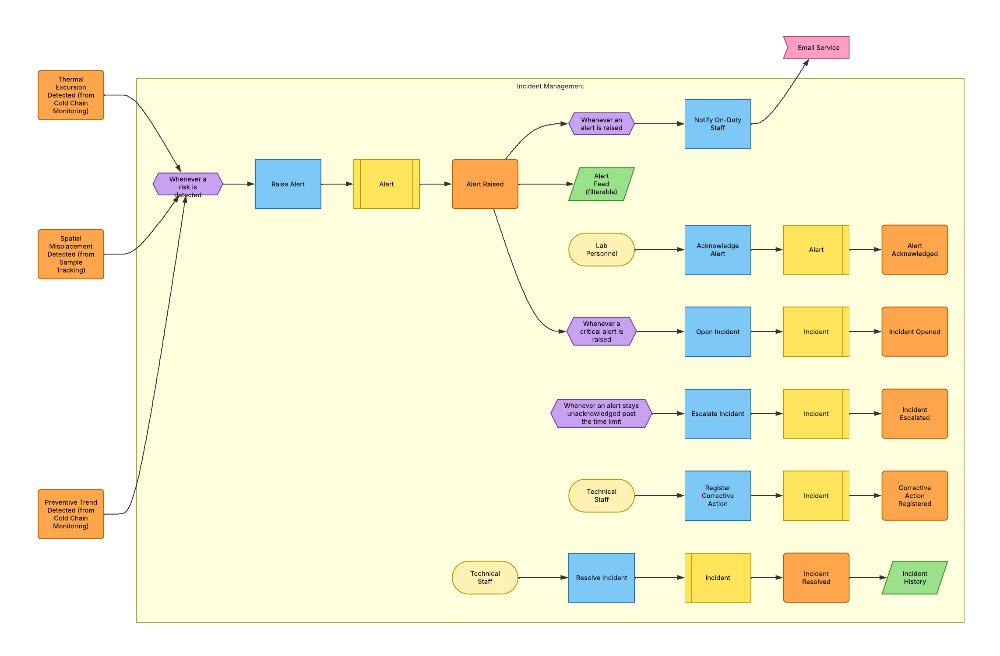
Diagram elaborated in Lucidchart.

#### 8. Compliance & Audit (Supporting)

Guarantees the regulatory traceability of the operation. A policy records every auditable action, such as sensor calibrations, registered corrective actions and resolved incidents, as an immutable entry in the **Activity Log**, which feeds the Audit Trail read model. Laboratory personnel can generate consolidated **Compliance Reports** for internal quality reviews and external audits, and archive the history of laboratories that are no longer operational.

| Element | Identified in this context |
|---|---|
| Aggregates | Activity Log, Compliance Report |
| Commands | Log Activity, Generate Compliance Report, Archive Laboratory History |
| Domain Events | Activity Logged, Compliance Report Generated, Laboratory History Archived |
| Queries (Read Models) | Audit Trail |
| Policies | Whenever an auditable action happens (Sensor Calibrated, Corrective Action Registered, Incident Resolved), log the activity |
| Actors / External Systems | Lab Personnel |

*Related user stories: US16, US19, US28.*

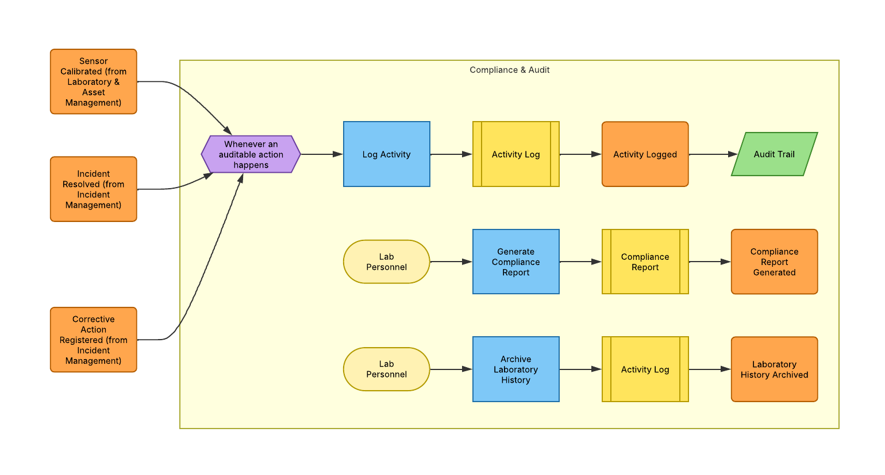
Diagram elaborated in Lucidchart.

### **4.6.2. Software Architecture Context Diagram**

The system context diagram shows the relationship between CryoVigil and its external actors, providing an overview of the solution and its interactions with the environment. CryoVigil appears as a single software system in the center, surrounded by the people who use it and the external systems it interacts with.

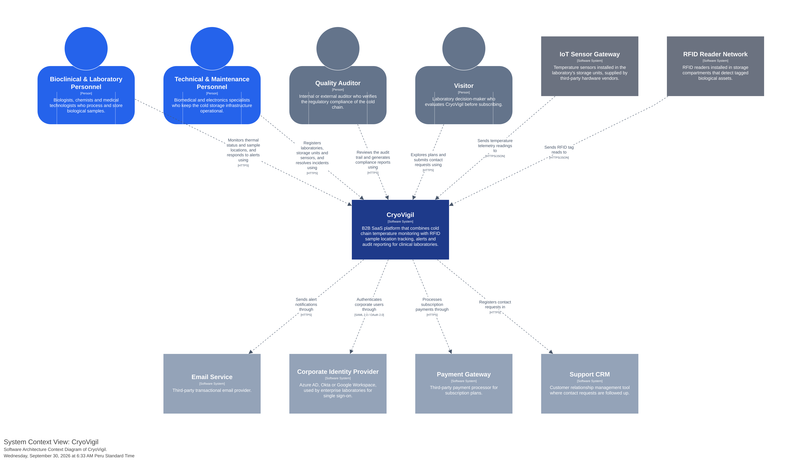
Diagram elaborated in Lucidchart.

The two target segments are the main users of the platform. **Bioclinical & Laboratory Personnel** monitor the thermal status and location of their samples and respond to alerts, while **Technical & Maintenance Personnel** register laboratories, storage units and sensors and resolve incidents. The **Quality Auditor** reviews the audit trail and generates compliance reports, and the **Visitor** explores the plans and submits contact requests through the landing page.

Because CryoVigil works at the application layer and is hardware-agnostic, the **IoT Sensor Gateway** and the **RFID Reader Network** are external systems that send temperature readings and RFID tag reads to the platform. CryoVigil also relies on four third-party services: an **Email Service** to deliver alert notifications, a **Corporate Identity Provider** for the single sign-on of enterprise laboratories, a **Payment Gateway** to process subscription payments, and a **Support CRM** where contact requests are followed up.

### **4.6.3. Software Architecture Container Diagrams**

The container diagram shows the high-level elements of CryoVigil's architecture, how responsibilities are distributed among them, the main technology decisions and how they communicate. Following the C4 Model, each container is an independent deployment unit.

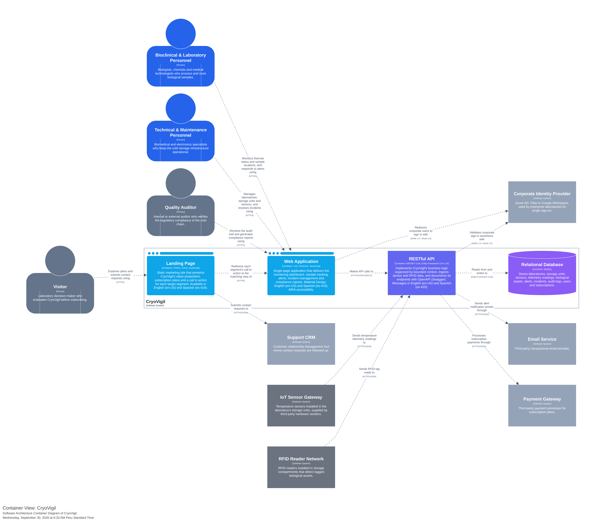
Diagram elaborated in Structurizr.

The solution is made up of four containers:

- **Landing Page (HTML5, CSS3, JavaScript):** a static marketing site that presents the value proposition, the subscription plans and a call to action for each target segment. Each call to action redirects visitors to the matching view of the Web Application, and the contact form submits requests to the Support CRM.
- **Web Application (Vue, PrimeVue, JavaScript):** a single-page application, designed with Material Design and ARIA accessibility, that delivers the monitoring dashboard, sample tracking, alerts, incident management and compliance reports. It calls the RESTful API over HTTPS/JSON and redirects corporate users to their identity provider for single sign-on.
- **RESTful API (ASP.NET Core, Entity Framework Core, C#):** implements the business logic organized by bounded context, ingests the data sent by the IoT Sensor Gateway and the RFID Reader Network, integrates the Email Service, the Payment Gateway and the Corporate Identity Provider, and documents its endpoints with OpenAPI (Swagger).
- **Relational Database (MySQL):** stores the information of every bounded context and is accessed only by the RESTful API through Entity Framework Core.

The Landing Page, the Web Application and the RESTful API support English (en-US) and Spanish (es-419), with English as the default language.

### **4.6.4. Software Architecture Components Diagrams**

This section presents the component diagrams of CryoVigil's software architecture. They break each container down into its main structural blocks, describing their responsibilities, technologies and interactions. Five diagrams are presented: one for the Landing Page, one for the Web Application and three for the RESTful API. The RESTful API is split into three views grouped by business flow (laboratory operations, response and compliance, and identity and platform), so each view stays readable while every bounded context keeps its own labeled boundary. The Relational Database is not decomposed, since in the C4 Model a database is a data store and has no components.

For the internal design of each **Bounded Context** of the RESTful API, a **Domain-Oriented Layered Architecture** has been applied. As shown in the diagrams, the flow keeps a high level of cohesion:

- **Controllers (Interfaces layer):** expose the REST endpoints consumed by the Web Application and by the external devices.
- **Application Services (Application layer):** orchestrate the use cases by processing commands and queries over the domain aggregates.
- **Event Handlers and Background Jobs (Application layer):** implement the policies identified in the Design-Level EventStorming, reacting to domain events published by other bounded contexts or to scheduled checks.
- **Outbound Services and Facades:** encapsulate the integration with third-party services (email, payments and single sign-on) and expose data to other bounded contexts through an anti-corruption layer.
- **Repositories (Infrastructure layer):** abstract persistence with Entity Framework Core, keeping the domain model independent of the database technology.

Bounded contexts communicate through domain events, shown as "Publishes … to" relationships toward the handler of the receiving context, and through the Profiles Facade when one context needs data owned by another.

---

#### Container: Landing Page

The Landing Page is organized as a vertical narrative of sections coordinated by the **Top Navigation**, which links to each section, hosts the language switcher and exposes the Request Demo and Sign In buttons. The **i18n Script** translates every section between English (en-US) and Spanish (es-419), with English as the default language. The **Hero Section**, **Segment CTAs Section** and **Pricing Section** redirect visitors to the matching view of the Web Application, while the **Contact Form** validates and submits demo and sales requests to the Support CRM. The **Footer** links to the **Terms of Service Page**, written according to the ACM/IEEE and CIP codes of ethics.

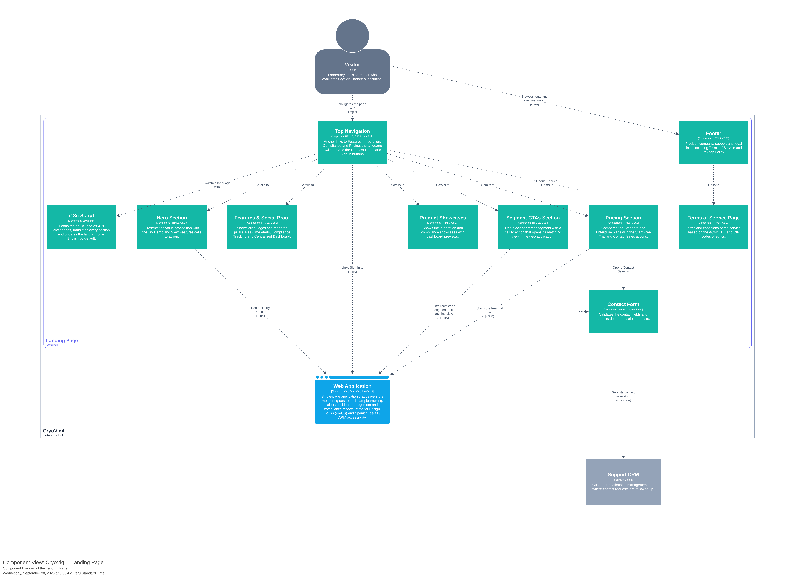
Diagram elaborated in Structurizr.