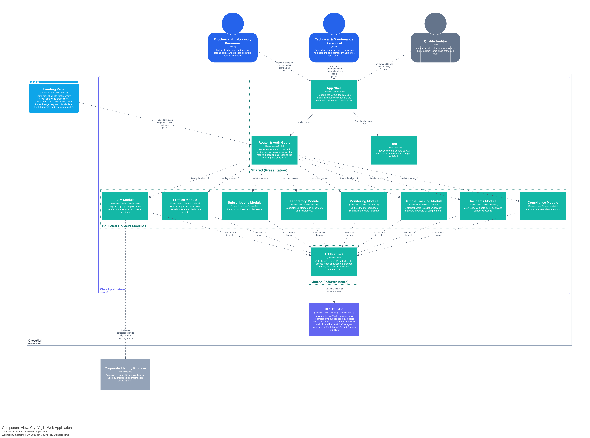

## **4.6. Domain-Driven Software Architecture**

This section builds on the Big Picture EventStorming presented in section 2.4 and takes it down to a design level following Domain-Driven Design, until the bounded contexts, aggregates, events, commands and queries of **CryoVigil** are identified. It then presents the software architecture of the solution using the C4 Model in Structurizr, through the Software Architecture Context Diagram, the Software Architecture Container Diagram and the Software Architecture Component Diagrams.

### **4.6.1. Design-Level Event Storming**

At this stage, the team carried out a detailed technical immersion to refine the workflow of **CryoVigil**. Unlike the previous stage, the *Design-Level EventStorming* made it possible to identify not only what happens in the system (**Domain Events**), but also who starts each action (**Actors** and **External Systems**), the intention behind it (**Commands**), the rules that govern the behavior of the software (**Policies**), the information users consult (**Read Models**) and the consistency boundaries that process each command (**Aggregates**).

During a focused design session, the elements were organized following the subdomains of a SaaS platform for laboratory cold chain monitoring. The result is a model of eight bounded contexts: three core contexts that deliver CryoVigil's value proposition by combining thermal telemetry with RFID location traceability, two supporting contexts that sustain the laboratory operation and its regulatory obligations, and three generic contexts common to any SaaS platform. The contexts collaborate through domain events, so each one keeps its own model and ubiquitous language while taking part in end-to-end flows such as detecting a thermal excursion, alerting the on-duty staff and recording the corrective action for audits.

Diagram elaborated in Lucidchart.

**Bounded Context 1**

...

**Bounded Context 2**

...

### 4.6.2. Software Architecture Context Diagram

...

### 4.6.3. Software Architecture Container Diagram

...

### 4.6.4. Software Architecture Component Diagrams

**Bounded Context 1**

**Bounded Context 2**

