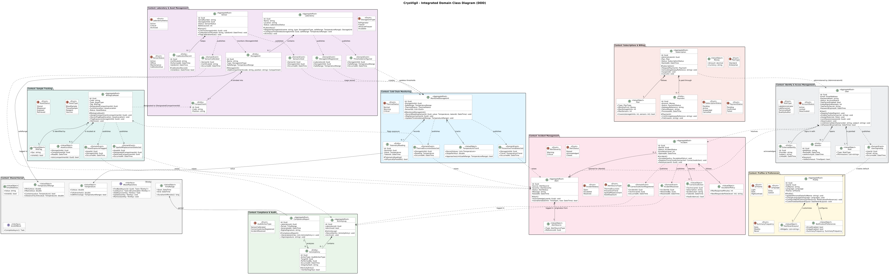
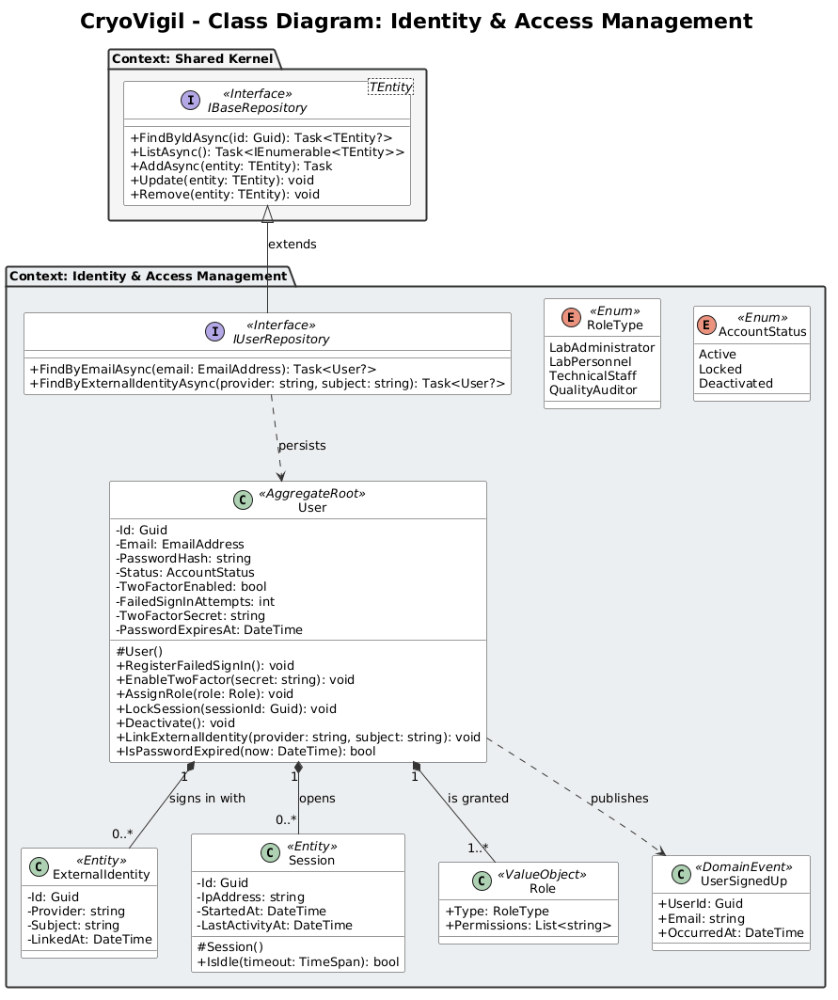

## **4.7. Software Object-Oriented Design**

This section presents the object-oriented design of the domain layer of CryoVigil's RESTful API, with a higher level of detail about how the components of each bounded context are implemented. The diagrams apply the tactical patterns of Domain-Driven Design (aggregate roots, entities, value objects, domain events and repositories) and follow the C# Coding Conventions: PascalCase names for types, properties and methods, and C# types such as `Guid`, `string`, `bool`, `DateTime`, `TimeSpan` and `decimal`. Every member shows its scope: the state of aggregate roots and entities is private and can only change through public methods that enforce the business rules; value objects and domain events expose public immutable properties; and aggregate roots and entities declare a protected parameterless constructor required by Entity Framework Core. Relationships are named and include their direction and multiplicity.

### **4.7.1. Class Diagrams**

CryoVigil's class diagram represents the static structure of the domain, detailing its fundamental types, their attributes, their behavior (methods) and the relationships that support the business logic. The design is organized following the boundaries of the bounded contexts identified in the Design-Level EventStorming, so that the technical implementation respects the ubiquitous language of each context.

The following class diagram has been designed applying the principles of Domain-Driven Design to model the business core of CryoVigil. Unlike a traditional data model (CRUD), it reflects the behavior and rules of a mission-critical monitoring system. The architecture is divided into highly decoupled bounded contexts that refer to each other by identifier and communicate through domain events. It makes a clear distinction between Aggregate Roots (which guarantee consistency), Entities (objects with an identity over time), Value Objects (immutable objects that describe characteristics), Domain Events (facts that other contexts react to) and Interfaces (the persistence contracts defined by the domain). The integrated diagram shows the domain model of all contexts, and the diagrams of each bounded context add their repository interfaces.

Diagram elaborated in PlantUML.

#### Identity & Access Management

This context is responsible for access control. Its aggregate root, `User`, keeps its credentials and security state private (email, password hash, account status, two-factor authentication, failed sign-in attempts and password expiration) and exposes operations to register failed sign-ins, enable two-factor authentication, assign roles, lock sessions, deactivate the account and link the external identity used for corporate single sign-on. `Session` entities support the inactivity timeout through `IsIdle`, `ExternalIdentity` entities store the provider and subject of each corporate identity, and the `Role` value object groups the permissions of each `RoleType`. When a user signs up, the aggregate publishes `UserSignedUp`. The `IUserRepository` interface extends `IBaseRepository<User>` with searches by email and by external identity.

Diagram elaborated in PlantUML.

