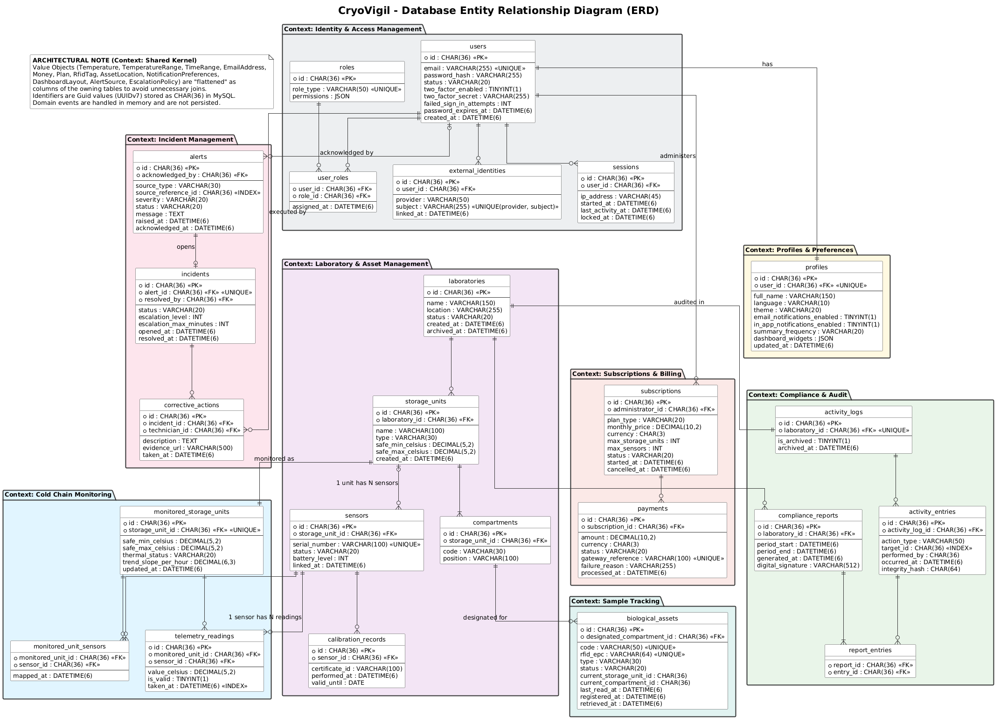
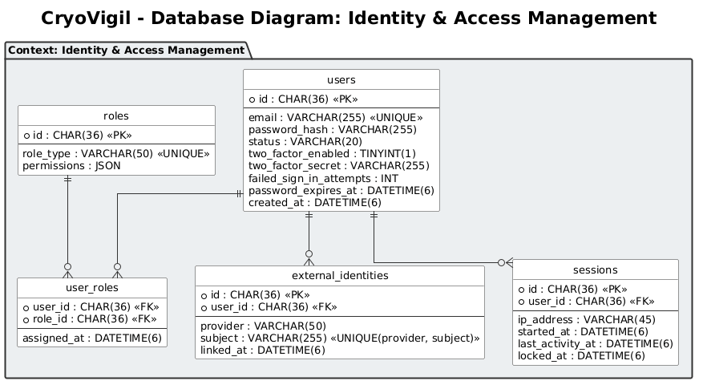
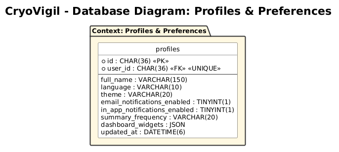
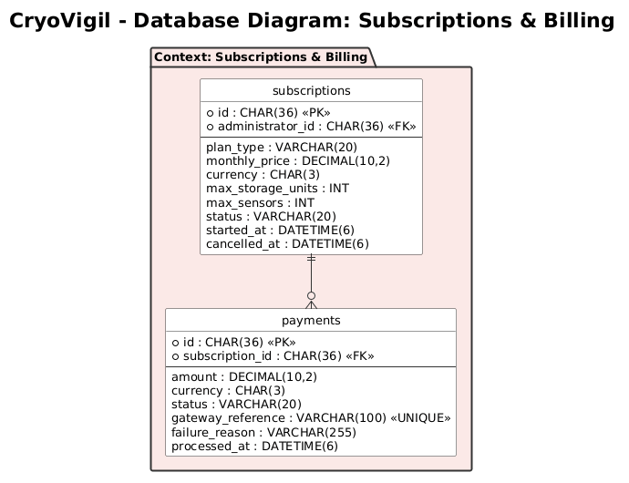
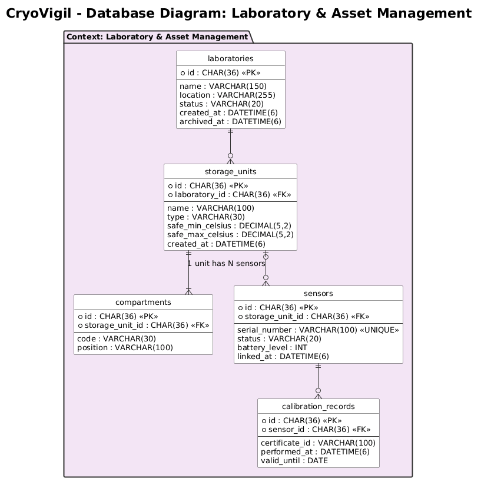
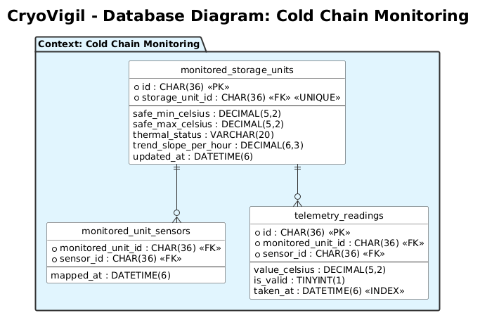
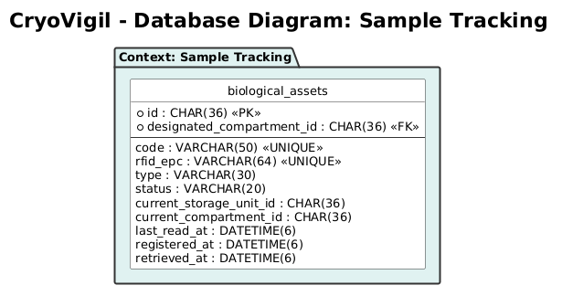

## **4.8. Database Design**

This section presents the database design of CryoVigil, which supports the persistence of the objects of every bounded context in a MySQL relational database accessed by the RESTful API through Entity Framework Core. The diagrams specify tables, columns, data types and constraints (primary keys, foreign keys, unique constraints and indexes), and show the relationships between tables using crow's foot notation. Tables are grouped by bounded context and named in English, in plural and in snake_case.

### **4.8.1. Database Diagrams**

The database design of **CryoVigil** has been normalized to guarantee referential integrity and efficient queries over large volumes of telemetry. Unlike the class diagram, this model focuses on data persistence through Primary Keys (**PK**) and Foreign Keys (**FK**).

The following Entity-Relationship Diagram (ERD) represents the physical persistence of CryoVigil's domain model in MySQL. Identifiers are `Guid` values generated as UUIDv7, which are ordered by time and therefore index efficiently, and are stored as `CHAR(36)`. As a key architectural decision, the value objects of the domain model (such as `TemperatureRange`, `RfidTag`, `AssetLocation`, `Plan` or `EscalationPolicy`) have been flattened: instead of separate tables that would require costly joins, their properties are stored as columns of their host tables (for example, `safe_min_celsius` and `safe_max_celsius` in `storage_units`). Collections of identifiers and roles are stored in link tables (`monitored_unit_sensors`, `user_roles`), and semi-structured data such as permissions and dashboard widgets uses the `JSON` type. Foreign keys are declared when a table references data owned by a single context, such as `profiles.user_id` or `biological_assets.designated_compartment_id`. References that may point to data of different contexts, such as `alerts.source_reference_id`, `activity_entries.target_id` or `activity_entries.performed_by`, are stored as indexed identifiers without a foreign key, so that each context can evolve independently. Traceability is guaranteed by the `activity_entries` table, whose integrity hash makes every record verifiable. Domain events are handled in memory and are not persisted.

Diagram elaborated in PlantUML.

#### Identity & Access Management

The `users` table stores the credentials and security state of each account, with a unique email. `roles` and `user_roles` implement the many-to-many relationship between users and roles, with permissions stored as `JSON`. `sessions` supports the inactivity timeout through `last_activity_at` and `locked_at`, and `external_identities` links each user to its corporate identity provider, with a unique combination of provider and subject.

Diagram elaborated in PlantUML.

#### Profiles & Preferences

The `profiles` table has a one-to-one relationship with `users` through a unique `user_id`. The `NotificationPreferences` value object is flattened into the notification and summary columns, and the dashboard layout is stored as `JSON`.

Diagram elaborated in PlantUML.

#### Subscriptions & Billing

The `subscriptions` table flattens the `Plan` value object into the plan type, price, currency and limit columns, and references its administrator in `users`. The `payments` table stores each payment attempt, with a unique `gateway_reference` that matches the notifications received from the Payment Gateway.

Diagram elaborated in PlantUML.

#### Laboratory & Asset Management

The `laboratories` table has a one-to-many relationship with `storage_units`, which store their safe temperature range as columns and are divided into `compartments`. `sensors` have a unique serial number and reference the storage unit they are linked to, which is optional until the sensor is installed, and `calibration_records` stores the calibration history of each sensor.

Diagram elaborated in PlantUML.

#### Cold Chain Monitoring

The `monitored_storage_units` table has a one-to-one relationship with `storage_units` through a unique `storage_unit_id`, and keeps its own copy of the safe range and thermal status. `monitored_unit_sensors` maps the sensors of each monitored unit, and `telemetry_readings`, the table with the highest volume of the system, stores each reading with an index on `taken_at` to speed up historical and trend queries.

Diagram elaborated in PlantUML.

#### Sample Tracking

The `biological_assets` table stores each asset with a unique code and a unique RFID EPC, references its designated compartment through a foreign key, and flattens the `AssetLocation` value object into the current storage unit, current compartment and last read columns.

Diagram elaborated in PlantUML.