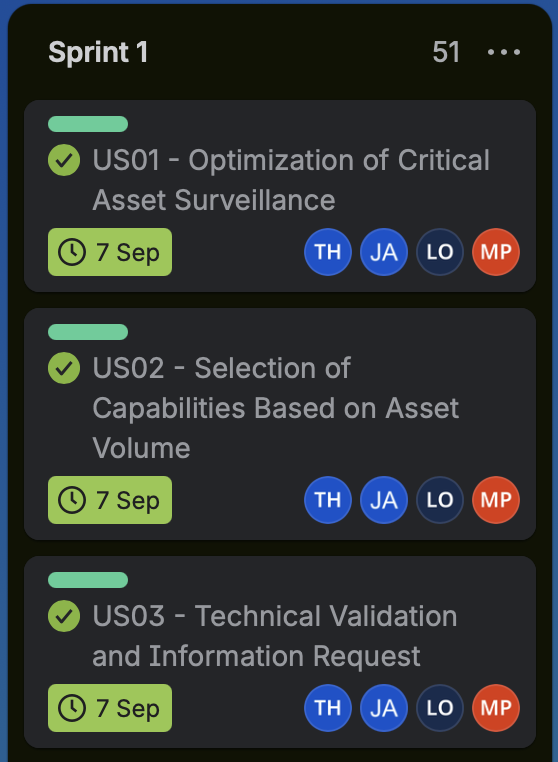
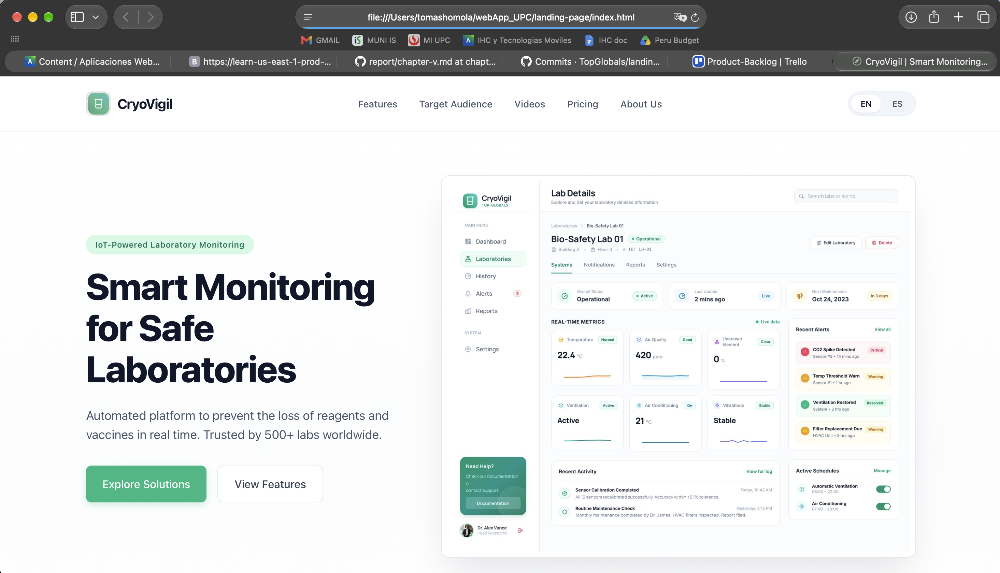
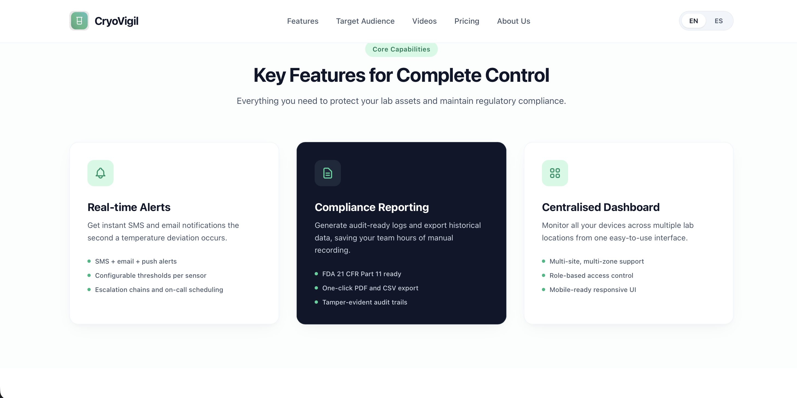
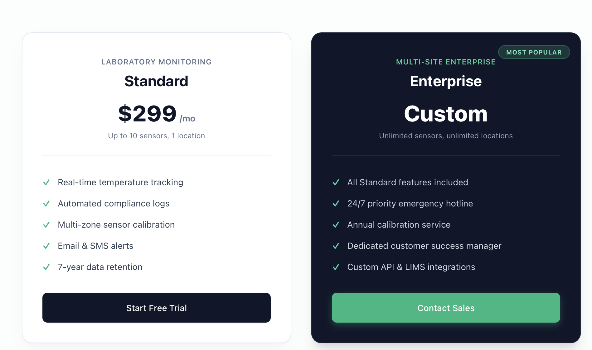
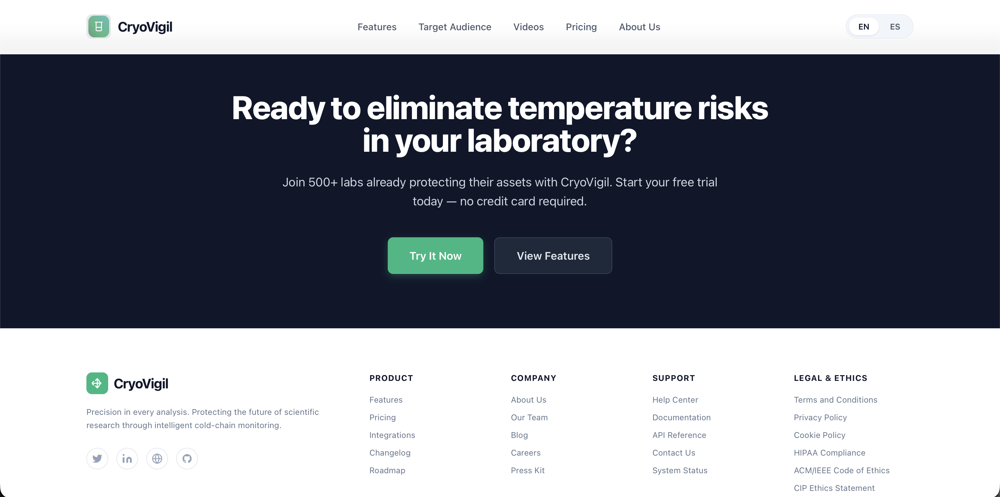
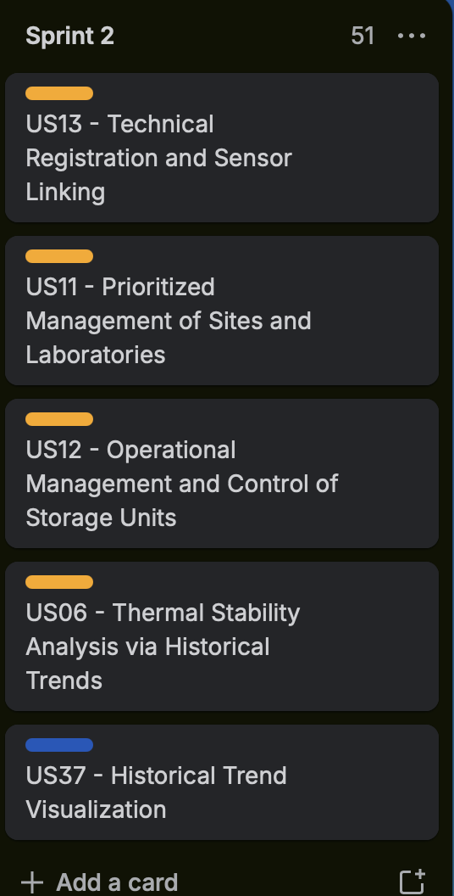
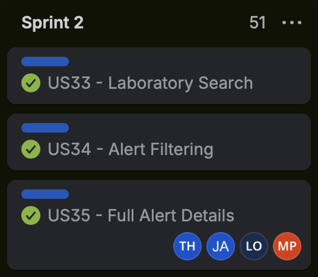
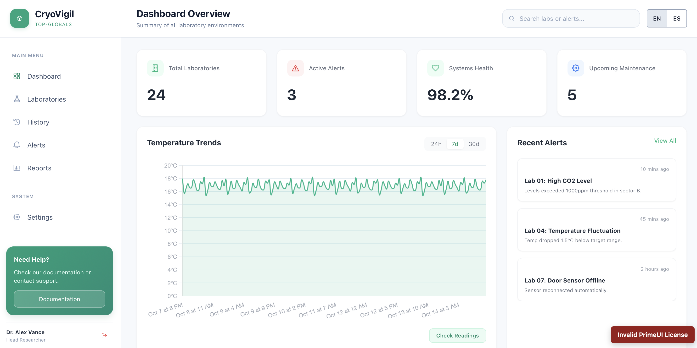
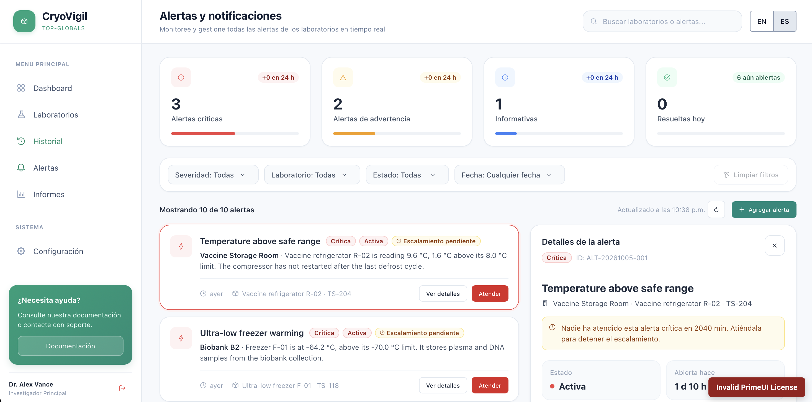
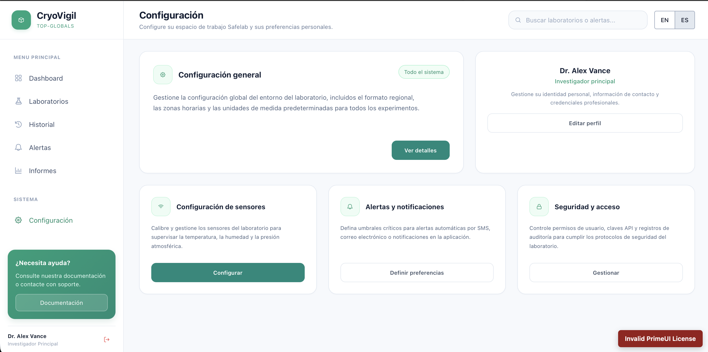

## 5.2. Landing Page, Services & Applications Implementation

### 5.2.1. Sprint 1

#### 5.2.1.1. Sprint Planning 1

<table>
	<tr>
		<th>Sprint</th>
		<td>Sprint 1</td>
	</tr>
	<tr>
		<th>Sprint Planning Background</th>
		<td>Sprint 1 is planned around Epic EP01 (Landing Page) and its three user stories, US01-US03, from Chapter 3.1. The work covers presenting monitoring capabilities, comparing subscription plans, and requesting technical information.</td>
	</tr>
	<tr>
		<th>Date</th>
		<td>10/09/2026</td>
	</tr>
	<tr>
		<th>Time</th>
		<td>3:30 p.m.</td>
	</tr>
	<tr>
		<th>Location</th>
		<td>Google Meet</td>
	</tr>
	<tr>
		<th>Prepared By</th>
		<td>Arizabal Condori, Jean Niels</td>
	</tr>
	<tr>
		<th>Attendees</th>
		<td>Arizabal Condori, Jean Niels;
		Homola, Tomas;
		Linares Rodriguez, Franco Orlando;
		Padilla Merino, Mauricio Jared;
		Reyes Munoz, Joaquin Leonardo
		</td>
	</tr>
	<tr>
		<th>Sprint 0 Review Summary</th>
		<td>Not applicable. Sprint 1 is the first sprint documented for this implementation; no Sprint 0 review was held.</td>
	</tr>
	<tr>
		<th>Sprint 0 Retrospective Summary</th>
		<td>Not applicable. Sprint 1 is the first sprint documented for this implementation; no Sprint 0 retrospective was held.</td>
	</tr>
	<tr>
		<th>Sprint Goal and User Stories</th>
		<td>Deliver the EP01 landing-page content and interactions described by US01-US03: explain monitoring and alert features, present subscription options, and provide a validated technical contact request form.</td>
	</tr>
	<tr>
		<th>Sprint 1 Goal</th>
		<td>Give laboratory decision-makers the information and actions needed to evaluate CryoVigil: understand its monitoring capabilities, compare plans, and request technical advice.</td>
	</tr>
	<tr>
		<th>Sprint 1 Velocity</th>
		<td>7 story points, based on US01 (3), US02 (2), and US03 (2). The Sprint 1 Trello board marks all three stories complete.</td>
	</tr>
	<tr>
		<th>Sum of Story Points</th>
		<td>7 planned points: US01 (3) + US02 (2) + US03 (2), according to the Chapter 3.3 product backlog.</td>
	</tr>
</table>

#### 5.2.1.2. Aspect Leaders and Collaborators

`L` identifies the aspect leader and `C` identifies a collaborator.

<table>
	<thead>
		<tr>
			<th>Team Member</th>
			<th>GitHub Username</th>
			<th>Landing Page (L/C)</th>
			<th>Documentation (L/C)</th>
		</tr>
	</thead>
	<tbody>
		<tr>
			<td>Arizabal Condori, Jean Niels</td>
			<td>JeanArizabal</td>
			<td>C</td>
			<td>L</td>
		</tr>
		<tr>
			<td>Homola, Tomas</td>
			<td>Ch1L1</td>
			<td>L</td>
			<td>C</td>
		</tr>
		<tr>
			<td>Linares Rodriguez, Franco Orlando</td>
			<td>Franchutec</td>
			<td>C</td>
			<td>C</td>
		</tr>
		<tr>
			<td>Padilla Merino, Mauricio Jared</td>
			<td>ClifeK</td>
			<td>C</td>
			<td>C</td>
		</tr>
		<tr>
			<td>Reyes Munoz, Joaquin Leonardo</td>
			<td>JoakoRM</td>
			<td>C</td>
			<td>C</td>
		</tr>
	</tbody>
</table>

#### 5.2.1.3. Sprint Backlog 1

**Sprint Objective:** Complete and verify the landing-page experience for US01-US03, including capability and alert information, subscription-plan comparison, and the validated technical contact request flow.

**Sprint backlog evidence:**

**Board URL:** [URL](https://trello.com/invite/b/6abd903b7dfafa389ebcf1af/ATTIee4feb898b09fdee6aafbb1c62ea8e275D4DCDFA/product-backlog)

<table>
	<thead>
		<tr>
			<th>Story Id</th>
			<th>Story Title</th>
			<th>Task Id</th>
			<th>Task Title</th>
			<th>Task Description</th>
			<th>Estimation (Hours)</th>
			<th>Assigned To</th>
			<th>Status</th>
		</tr>
	</thead>
	<tbody>
		<tr>
			<td>US01</td>
			<td>Optimization of Critical Asset Surveillance</td>
			<td>S1-01</td>
			<td>Present monitoring capabilities</td>
			<td>Describe 24/7 monitoring and smart alerts, and explain how they help protect samples and reduce manual measurement errors.</td>
			<td>4</td>
			<td>Tomas Homola</td>
			<td>Done</td>
		</tr>
		<tr>
			<td>US01</td>
			<td>Optimization of Critical Asset Surveillance</td>
			<td>S1-02</td>
			<td>Provide technical information action</td>
			<td>Add a More Information or Download Datasheet action so visitors can obtain technical details when the landing-page summary is insufficient.</td>
			<td>3.5</td>
			<td>Tomas Homola</td>
			<td>Done</td>
		</tr>
		<tr>
			<td>US02</td>
			<td>Selection of Capabilities Based on Asset Volume</td>
			<td>S1-03</td>
			<td>Present and compare subscription plans</td>
			<td>Show plan benefits and the Get Started action; include the Enterprise recommendation when a laboratory's stated regulatory needs exceed a selected plan.</td>
			<td>2</td>
			<td>Jean Condori</td>
			<td>Done</td>
		</tr>
		<tr>
			<td>US03</td>
			<td>Technical Validation and Information Request</td>
			<td>S1-04</td>
			<td>Build and validate contact form</td>
			<td>Provide name, corporate email, and message fields; prevent submission when required input is missing or the email format is invalid.</td>
			<td>3</td>
			<td>Franco Rodriguez</td>
			<td>Done</td>
		</tr>
		<tr>
			<td>US03</td>
			<td>Technical Validation and Information Request</td>
			<td>S1-05</td>
			<td>Confirm and register contact requests</td>
			<td>Show a successful-submission confirmation and connect the request to the support CRM, as required by the US03 acceptance criteria.</td>
			<td>3</td>
			<td>Joaquin Munoz</td>
			<td>Done</td>
		</tr>
	</tbody>
</table>

#### 5.2.1.4. Development Evidence for Sprint Review

The following commits are from the Landing Page repository. They document project setup, landing-page implementation, responsive improvements, and integration into the main branch.

<table>
	<thead>
		<tr>
			<th>Repository</th>
			<th>Branch</th>
			<th>Commit Id</th>
			<th>Commit Message</th>
			<th>Commit Message Body</th>
			<th>Committed on (Date, UTC)</th>
		</tr>
	</thead>
	<tbody>
		<tr>
			<td><a href="https://github.com/TopGlobals/landing-page">TopGlobals/landing-page</a></td>
			<td>main</td>
			<td><a href="https://github.com/TopGlobals/landing-page/commit/eae40e57bd4a81d6554c5a0ace9e341266f8fd3c">eae40e5</a></td>
			<td>Merge pull request #1 from TopGlobals/develop</td>
			<td>Develop</td>
			<td>2026-10-07</td>
		</tr>
		<tr>
			<td><a href="https://github.com/TopGlobals/landing-page">TopGlobals/landing-page</a></td>
			<td>develop</td>
			<td><a href="https://github.com/TopGlobals/landing-page/commit/b72ada07601d702b52eba03a5e6e66f95d7f1d57">b72ada0</a></td>
			<td>Merge branch 'feature/mobile-version-lp' into develop</td>
			<td>No commit body</td>
			<td>2026-10-05</td>
		</tr>
		<tr>
			<td><a href="https://github.com/TopGlobals/landing-page">TopGlobals/landing-page</a></td>
			<td>feature/mobile-version-lp</td>
			<td><a href="https://github.com/TopGlobals/landing-page/commit/2514bdc069661e038ca70a331d991c24af8f3762">2514bdc</a></td>
			<td>feat(mobile-version): implement mobile carousel for key sections and enhance navigation accessibility</td>
			<td>No commit body</td>
			<td>2026-10-05</td>
		</tr>
		<tr>
			<td><a href="https://github.com/TopGlobals/landing-page">TopGlobals/landing-page</a></td>
			<td>develop</td>
			<td><a href="https://github.com/TopGlobals/landing-page/commit/448664efb9a96ca99141053ab0708809e627a3bd">448664e</a></td>
			<td>Merge branch 'feature/about-us' into develop</td>
			<td>No commit body</td>
			<td>2026-10-05</td>
		</tr>
		<tr>
			<td><a href="https://github.com/TopGlobals/landing-page">TopGlobals/landing-page</a></td>
			<td>feature/about-us</td>
			<td><a href="https://github.com/TopGlobals/landing-page/commit/8de49bdfb185bb76b657fa5acd1d469c40747a5e">8de49bd</a></td>
			<td>feat(about-us): add new section to landing page</td>
			<td>No commit body</td>
			<td>2026-10-03</td>
		</tr>
		<tr>
			<td><a href="https://github.com/TopGlobals/landing-page">TopGlobals/landing-page</a></td>
			<td>develop</td>
			<td><a href="https://github.com/TopGlobals/landing-page/commit/94228a1dad0ba13d3e8ddb233f04e78475f48b50">94228a1</a></td>
			<td>Merge branch 'feature/landing-page' into develop</td>
			<td>No commit body</td>
			<td>2026-09-30</td>
		</tr>
		<tr>
			<td><a href="https://github.com/TopGlobals/landing-page">TopGlobals/landing-page</a></td>
			<td>feature/landing-page</td>
			<td><a href="https://github.com/TopGlobals/landing-page/commit/c2c406d4d96a537435b8afa638d9b83a8e95979c">c2c406d</a></td>
			<td>feat(landing-page): overhaul landing page structure and styles for improved layout and responsiveness</td>
			<td>No commit body</td>
			<td>2026-09-30</td>
		</tr>
		<tr>
			<td><a href="https://github.com/TopGlobals/landing-page">TopGlobals/landing-page</a></td>
			<td>feature/landing-page</td>
			<td><a href="https://github.com/TopGlobals/landing-page/commit/98770abadd0ec4b2f711073e14ac74c0428d950d">98770ab</a></td>
			<td>Merge branch 'develop' into feature/landing-page</td>
			<td>No commit body</td>
			<td>2026-09-30</td>
		</tr>
		<tr>
			<td><a href="https://github.com/TopGlobals/landing-page">TopGlobals/landing-page</a></td>
			<td>develop</td>
			<td><a href="https://github.com/TopGlobals/landing-page/commit/75544ebf48758b2dc79e19fab4174f5cc6548dae">75544eb</a></td>
			<td>Merge branch 'feature/project-setup' into develop</td>
			<td>No commit body</td>
			<td>2026-09-30</td>
		</tr>
		<tr>
			<td><a href="https://github.com/TopGlobals/landing-page">TopGlobals/landing-page</a></td>
			<td>feature/project-setup</td>
			<td><a href="https://github.com/TopGlobals/landing-page/commit/24af3ecdddd82ad0fab1f882ece1f25d054d319c">24af3ec</a></td>
			<td>chore: add .idea to .gitignore</td>
			<td>No commit body</td>
			<td>2026-09-30</td>
		</tr>
		<tr>
			<td><a href="https://github.com/TopGlobals/landing-page">TopGlobals/landing-page</a></td>
			<td>feature/project-setup</td>
			<td><a href="https://github.com/TopGlobals/landing-page/commit/bb868799b33573df50a3d4528d556106963fd8f4">bb86879</a></td>
			<td>docs: update README with project description and usage instructions</td>
			<td>No commit body</td>
			<td>2026-09-29</td>
		</tr>
		<tr>
			<td><a href="https://github.com/TopGlobals/landing-page">TopGlobals/landing-page</a></td>
			<td>feature/landing-page</td>
			<td><a href="https://github.com/TopGlobals/landing-page/commit/160b5be3b0b421998d60908a705f99a1e11413cd">160b5be</a></td>
			<td>feat(landing-page): add implementation of landing page as html and css, together with images used in it</td>
			<td>No commit body</td>
			<td>2026-09-17</td>
		</tr>
		<tr>
			<td><a href="https://github.com/TopGlobals/landing-page">TopGlobals/landing-page</a></td>
			<td>feature/project-setup</td>
			<td><a href="https://github.com/TopGlobals/landing-page/commit/52ba60025c4a043e1f665230805a5b16de4bc3f8">52ba600</a></td>
			<td>chore(project-setup): initial setup of project structure</td>
			<td>No commit body</td>
			<td>2026-09-16</td>
		</tr>
		<tr>
			<td><a href="https://github.com/TopGlobals/landing-page">TopGlobals/landing-page</a></td>
			<td>main</td>
			<td><a href="https://github.com/TopGlobals/landing-page/commit/f4fc9aa562fdf08fa058a1d8c1d3d1f3ff342478">f4fc9aa</a></td>
			<td>chore: initial commit</td>
			<td>No commit body</td>
			<td>2026-09-16</td>
		</tr>
	</tbody>
</table>

#### 5.2.1.5. Execution Evidence for Sprint Review

The screenshots below show the implemented landing-page pricing, feature information, and hero sections. Together they provide visual evidence for the landing-page work associated with US01, US02 and 03.

**Pricing plans (US02)**

**Monitoring features (US01)**

**Landing-page home screen**

**Call to action and footer**

#### 5.2.1.6. Services Documentation Evidence for Sprint Review

Sprint 1 delivered the static landing page. The source repository for the implemented landing page is [TopGlobals/landing-page](https://github.com/TopGlobals/landing-page).

#### 5.2.1.7. Software Deployment Evidence for Sprint Review

**Deployed landing page:** [[Landing Page URL](https://topglobals.github.io/landing-page/)]

#### 5.2.1.8. Team Collaboration Insights during Sprint

The Sprint 1 Trello board groups the work under US01-US03 and marks all three stories complete. The backlog table above records the task owners, while the Landing Page repository shows feature work integrated through `develop` and a pull request into `main`. This provides evidence of task allocation and code integration.

**Sprint 1 board:** [Open the Trello board](https://trello.com/invite/b/6abd903b7dfafa389ebcf1af/ATTIee4feb898b09fdee6aafbb1c62ea8e275D4DCDFA/product-backlog)

---

### 5.2.2. Sprint 2

#### 5.2.2.1. Sprint Planning 2

<table>
	<tr>
		<th>Sprint</th>
		<td>Sprint 2</td>
	</tr>
	<tr>
		<th>Sprint Planning Background</th>
		<td>Sprint 2 focuses on frontend user stories US05, US06, US07, US08, US09, US11, US12, US33, US34, US35, US37, US38, US39, US41, US44, US47, US49, and US51 from the Chapter 3.1 requirements and Chapter 3.3 product backlog.</td>
	</tr>
	<tr>
		<th>Date</th>
		<td>05/10/2026</td>
	</tr>
	<tr>
		<th>Time</th>
		<td>12:00 p.m.</td>
	</tr>
	<tr>
		<th>Location</th>
		<td>Google Meets</td>
	</tr>
	<tr>
		<th>Prepared By</th>
		<td>Arizabal Condori, Jean Niels</td>
	</tr>
	<tr>
		<th>Attendees</th>
		<td>Arizabal Condori, Jean Niels;
		Homola, Tomas;
		Linares Rodriguez, Franco Orlando;
		Padilla Merino, Mauricio Jared;
		Reyes Munoz, Joaquin Leonardo</td>
	</tr>
	<tr>
		<th>Sprint 1 Review Summary</th>
		<td>All ussestories from Sprint 1 backlog were succesfully solved.</td>
	</tr>
	<tr>
		<th>Sprint 1 Retrospective Summary</th>
		<td>Communication needs to be improved. Positivi thing is that product was developed in time. Organization and task selection needs to be improved.</td>
	</tr>
	<tr>
		<th>Sprint Goal and User Stories</th>
		<td>Deliver frontend workflows for real-time thermal monitoring, historical trends and heatmaps, laboratory listing and detail management, alert history/filtering/details, user profile and notification settings, session persistence, theme accessibility, dashboard customization, maintenance notices, and mobile access. Selected stories: US05, US06, US07, US08, US09, US11, US12, US33, US34, US35, US37, US38, US39, US41, US44, US47, US49, and US51.</td>
	</tr>
	<tr>
		<th>Sprint 2 Goal</th>
		<td>Enable laboratory staff to monitor and analyze cold-chain conditions, find and manage laboratories, review and respond to alerts, and tailor the application to their account and device needs.</td>
	</tr>
	<tr>
		<th>Sprint 2 Velocity</th>
		<td>61/61 story points completed.</td>
	</tr>
	<tr>
		<th>Sum of Story Points</th>
		<td>61 planned points, calculated from the selected user stories in Chapter 3.3.</td>
	</tr>
</table>

#### 5.2.2.2. Aspect Leaders and Collaborators

<table>
	<thead>
		<tr>
			<th>Team Member</th>
			<th>GitHub Username</th>
			<th>Web Application</th>
			<th>Fake Api</th>
			<th>Documentación</th>
		</tr>
	</thead>
	<tbody>
		<tr>
			<td>Arizabal Condori, Jean Niels</td>
			<td>JeanArizabal</td>
			<td>C</td>
			<td>C</td>
			<td>L</td>
		</tr>
		<tr>
			<td>Homola, Tomas</td>
			<td>Ch1L1</td>
			<td>L</td>
			<td>C</td>
			<td>C</td>
		</tr>
		<tr>
			<td>Linares Rodriguez, Franco Orlando</td>
			<td>Franchutec</td>
			<td>-</td>
			<td>-</td>
			<td>-</td>
		</tr>
		<tr>
			<td>Padilla Merino, Mauricio Jared</td>
			<td>ClifeK</td>
			<td>C</td>
			<td>C</td>
			<td>C</td>
		</tr>
		<tr>
			<td>Reyes Munoz, Joaquin Leonardo</td>
			<td>JoakoRM</td>
			<td>C</td>
			<td>L</td>
			<td>C</td>
		</tr>
	</tbody>
</table>

#### 5.2.2.3. Sprint Backlog 2

**Sprint Objective:** Deliver the selected frontend user stories for thermal monitoring and analysis, laboratory management, alert workflows, user preferences, dashboard customization, maintenance notices, and responsive mobile access.

**Sprint backlog evidence:**

**Board URL:** [URL(https://trello.com/invite/b/6abd903b7dfafa389ebcf1af/ATTIee4feb898b09fdee6aafbb1c62ea8e275D4DCDFA/product-backlog)]

The hours below are estimated task effort. All Sprint 2 tasks are marked Done.

<table>
	<thead>
		<tr>
			<th>Story Id</th>
			<th>Story Title</th>
			<th>Story Points</th>
			<th>Task Id</th>
			<th>Task Title</th>
			<th>Task Description</th>
			<th>Estimation (Hours)</th>
			<th>Assigned To</th>
			<th>Status</th>
		</tr>
	</thead>
	<tbody>
		<tr>
			<td>US05</td>
			<td>Real-Time Thermal Monitoring and Risk Detection</td>
			<td>8</td>
			<td>S2-01</td>
			<td>Display real-time thermal status</td>
			<td>Present current sensor readings for storage units in a centralized dashboard and visually identify units outside safe temperature thresholds.</td>
			<td>20</td>
			<td>Homola, Tomas</td>
			<td>Done</td>
		</tr>
		<tr>
			<td>US06</td>
			<td>Thermal Stability Analysis via Historical Trends</td>
			<td>5</td>
			<td>S2-02</td>
			<td>Visualize historical temperature trends</td>
			<td>Display temperature history over the selected period against upper and lower allowed limits, and indicate gaps caused by missing sensor data.</td>
			<td>12</td>
			<td>Arizabal Condori, Jean Niels</td>
			<td>Done</td>
		</tr>
		<tr>
			<td>US07</td>
			<td>Critical Point Identification via Heatmap</td>
			<td>5</td>
			<td>S2-03</td>
			<td>Show laboratory equipment heatmap</td>
			<td>Represent storage-unit conditions by location, identify thermal-risk zones, and distinguish unavailable sensors or power failures from normal readings.</td>
			<td>12</td>
			<td>Reyes Munoz, Joaquin Leonardo</td>
			<td>Done</td>
		</tr>
		<tr>
			<td>US08</td>
			<td>Traceability of Recent Critical Alerts</td>
			<td>3</td>
			<td>S2-04</td>
			<td>Display recent critical alerts</td>
			<td>Show a chronological alert list with alert type, affected unit, severity, and an indication when an alert is awaiting escalation.</td>
			<td>8</td>
			<td>Arizabal Condori, Jean Niels</td>
			<td>Done</td>
		</tr>
		<tr>
			<td>US09</td>
			<td>Rapid Alert Response from Dashboard</td>
			<td>3</td>
			<td>S2-05</td>
			<td>Acknowledge and act on dashboard alerts</td>
			<td>Allow a technician to acknowledge an alert, record an initial corrective action, and show an error if another user is already handling it.</td>
			<td>8</td>
			<td>Padilla Merino, Mauricio Jared</td>
			<td>Done</td>
		</tr>
		<tr>
			<td>US11</td>
			<td>Prioritized Management of Sites and Laboratories</td>
			<td>3</td>
			<td>S2-06</td>
			<td>Filter and prioritize laboratories</td>
			<td>List laboratories with filters for critical status and location, and show disconnected status when sensor-gateway data is unavailable.</td>
			<td>8</td>
			<td>Reyes Munoz, Joaquin Leonardo</td>
			<td>Done</td>
		</tr>
		<tr>
			<td>US12</td>
			<td>Operational Management and Control of Storage Units</td>
			<td>5</td>
			<td>S2-07</td>
			<td>Manage laboratory details and settings</td>
			<td>Provide a laboratory detail view for storage units and sensors, including threshold updates and permission-aware changes to operating parameters.</td>
			<td>12</td>
			<td>Homola, Tomas</td>
			<td>Done</td>
		</tr>
		<tr>
			<td>US33</td>
			<td>Laboratory Search</td>
			<td>2</td>
			<td>S2-08</td>
			<td>Search laboratories by name</td>
			<td>Add a laboratory search control that helps users quickly find a laboratory by its name.</td>
			<td>5</td>
			<td>Arizabal Condori, Jean Niels</td>
			<td>Done</td>
		</tr>
		<tr>
			<td>US34</td>
			<td>Alert Filtering</td>
			<td>2</td>
			<td>S2-09</td>
			<td>Filter alerts</td>
			<td>Provide alert filters that let users narrow the alert list by relevant criteria and prioritize incidents.</td>
			<td>5</td>
			<td>Padilla Merino, Mauricio Jared</td>
			<td>Done</td>
		</tr>
		<tr>
			<td>US35</td>
			<td>Full Alert Details</td>
			<td>2</td>
			<td>S2-10</td>
			<td>Show full alert details</td>
			<td>Let a user open an alert and view its full details to understand the incident.</td>
			<td>5</td>
			<td>Padilla Merino, Mauricio Jared</td>
			<td>Done</td>
		</tr>
		<tr>
			<td>US37</td>
			<td>Historical Trend Visualization</td>
			<td>3</td>
			<td>S2-11</td>
			<td>Visualize historical event trends</td>
			<td>Show trends in historical events so users can identify and analyze patterns over time.</td>
			<td>8</td>
			<td>Homola, Tomas</td>
			<td>Done</td>
		</tr>
		<tr>
			<td>US38</td>
			<td>User Profile Editing</td>
			<td>2</td>
			<td>S2-12</td>
			<td>Edit user profile</td>
			<td>Allow a user to update personal profile information and retain the updated values.</td>
			<td>5</td>
			<td>Reyes Munoz, Joaquin Leonardo</td>
			<td>Done</td>
		</tr>
		<tr>
			<td>US39</td>
			<td>Real-Time System Notifications</td>
			<td>2</td>
			<td>S2-13</td>
			<td>Show action notifications</td>
			<td>Display visual notifications to the user after important system actions.</td>
			<td>5</td>
			<td>Arizabal Condori, Jean Niels</td>
			<td>Done</td>
		</tr>
		<tr>
			<td>US41</td>
			<td>Session Persistence</td>
			<td>2</td>
			<td>S2-14</td>
			<td>Persist active user session</td>
			<td>Keep the user's session active between visits so they do not need to log in repeatedly, subject to the application's security behavior.</td>
			<td>5</td>
			<td>Homola, Tomas</td>
			<td>Done</td>
		</tr>
		<tr>
			<td>US44</td>
			<td>In-App UI Theme and High-Contrast Accessibility Settings</td>
			<td>2</td>
			<td>S2-15</td>
			<td>Provide display theme settings</td>
			<td>Allow users to choose Light Mode, Dark Mode, or a high-contrast theme to improve readability in different lighting conditions.</td>
			<td>5</td>
			<td>Padilla Merino, Mauricio Jared</td>
			<td>Done</td>
		</tr>
		<tr>
			<td>US47</td>
			<td>Customizable Dashboard Widget Layouts</td>
			<td>5</td>
			<td>S2-16</td>
			<td>Customize dashboard widgets</td>
			<td>Allow users to drag, resize, and reorder dashboard widgets such as heatmaps, line charts, and alert feeds.</td>
			<td>12</td>
			<td>Arizabal Condori, Jean Niels</td>
			<td>Done</td>
		</tr>
		<tr>
			<td>US49</td>
			<td>In-App System Maintenance and Outage Banners</td>
			<td>2</td>
			<td>S2-17</td>
			<td>Display maintenance notices</td>
			<td>Provide a system-wide banner to inform active users about scheduled maintenance or temporary service outages.</td>
			<td>5</td>
			<td>Reyes Munoz, Joaquin Leonardo</td>
			<td>Done</td>
		</tr>
		<tr>
			<td>US51</td>
			<td>Mobile Web Responsive Layout Optimization</td>
			<td>5</td>
			<td>S2-18</td>
			<td>Support mobile incident response</td>
			<td>Ensure the dashboard and alert workflows are usable in a smartphone browser, including acknowledging alerts and recording corrective actions.</td>
			<td>12</td>
			<td>Homola, Tomas</td>
			<td>Done</td>
		</tr>
		<tr>
			<th colspan="2">Total story points</th>
			<th>61</th>
			<td colspan="6"></td>
		</tr>
	</tbody>
</table>

#### 5.2.2.4. Development Evidence for Sprint Review

The following representative commits document Sprint 2 implementation across laboratory management, settings, alerts, history, and dashboard analytics. Commit metadata and dates were verified against the [TopGlobals/frontend repository](https://github.com/TopGlobals/frontend).

<table>
	<thead>
		<tr>
			<th>Repository</th>
			<th>Branch</th>
			<th>Commit Id</th>
			<th>Commit Message</th>
			<th>Commit Message Body</th>
			<th>Committed on (Date, UTC)</th>
		</tr>
	</thead>
	<tbody>
		<tr>
			<td><a href="https://github.com/TopGlobals/frontend">TopGlobals/frontend</a></td>
			<td>feature/laboratories-panel</td>
			<td><a href="https://github.com/TopGlobals/frontend/commit/92a4e75dc8e6da5ef399bb43d69ee323ec582806">92a4e75</a></td>
			<td>feat(laboratories-panel): add laboratories panel component with filtering, pagination, and responsive layout</td>
			<td>No commit body</td>
			<td>2026-10-04</td>
		</tr>
		<tr>
			<td><a href="https://github.com/TopGlobals/frontend">TopGlobals/frontend</a></td>
			<td>feature/laboratory-create</td>
			<td><a href="https://github.com/TopGlobals/frontend/commit/40e3ffe835a3c5200818bc6b5665b1f6f8139f30">40e3ffe</a></td>
			<td>feat(laboratory-create): add laboratory creation form with sensor configuration and notification settings</td>
			<td>No commit body</td>
			<td>2026-10-04</td>
		</tr>
		<tr>
			<td><a href="https://github.com/TopGlobals/frontend">TopGlobals/frontend</a></td>
			<td>feature/settings-page</td>
			<td><a href="https://github.com/TopGlobals/frontend/commit/a32555d87e91a6df779715044aaa874ec2a08d1b">a32555d</a></td>
			<td>feat(settings-page): add alerts and notifications settings page</td>
			<td>No commit body</td>
			<td>2026-10-05</td>
		</tr>
		<tr>
			<td><a href="https://github.com/TopGlobals/frontend">TopGlobals/frontend</a></td>
			<td>alerts-page</td>
			<td><a href="https://github.com/TopGlobals/frontend/commit/952cac218fcc39ffa5bbd80e66d8acd589c71637">952cac2</a></td>
			<td>chore(server): seed alerts collection in mock api</td>
			<td>No commit body</td>
			<td>2026-10-06</td>
		</tr>
		<tr>
			<td><a href="https://github.com/TopGlobals/frontend">TopGlobals/frontend</a></td>
			<td>alerts-page</td>
			<td><a href="https://github.com/TopGlobals/frontend/commit/41596412a98b9067a17ba7e893576a3230769b48">4159641</a></td>
			<td>feat(alerts): add resolve dialog component for corrective actions</td>
			<td>No commit body</td>
			<td>2026-10-06</td>
		</tr>
		<tr>
			<td><a href="https://github.com/TopGlobals/frontend">TopGlobals/frontend</a></td>
			<td>alerts-page</td>
			<td><a href="https://github.com/TopGlobals/frontend/commit/4e2c61a2f07ca94ed8fd2754d8827e2be560d30f">4e2c61a</a></td>
			<td>feat(alerts): add create alert action with daily sequential codes</td>
			<td>No commit body</td>
			<td>2026-10-06</td>
		</tr>
		<tr>
			<td><a href="https://github.com/TopGlobals/frontend">TopGlobals/frontend</a></td>
			<td>alerts-page</td>
			<td><a href="https://github.com/TopGlobals/frontend/commit/81b4b220372bef771f9b9343b7c910500c5bac6b">81b4b22</a></td>
			<td>feat(alerts): add alert button and creation dialog to alerts view</td>
			<td>No commit body</td>
			<td>2026-10-06</td>
		</tr>
		<tr>
			<td><a href="https://github.com/TopGlobals/frontend">TopGlobals/frontend</a></td>
			<td>feature/history</td>
			<td><a href="https://github.com/TopGlobals/frontend/commit/3ecc6396c5cc8faaf7e2cfa674709d1f700733b2">3ecc639</a></td>
			<td>feat(history): implement complete localized history log module with chart and navigation</td>
			<td>No commit body</td>
			<td>2026-10-06</td>
		</tr>
		<tr>
			<td><a href="https://github.com/TopGlobals/frontend">TopGlobals/frontend</a></td>
			<td>feature/analytics</td>
			<td><a href="https://github.com/TopGlobals/frontend/commit/edf47975fe32d1ebb8a36d74fec1c29325e99a72">edf4797</a></td>
			<td>feat(dashboard): add analytics domain</td>
			<td>No commit body</td>
			<td>2026-10-07</td>
		</tr>
		<tr>
			<td><a href="https://github.com/TopGlobals/frontend">TopGlobals/frontend</a></td>
			<td>feature/analytics</td>
			<td><a href="https://github.com/TopGlobals/frontend/commit/3fdd58225792eacb94c54b158585e9614572a409">3fdd582</a></td>
			<td>feat(dashboard): add analytics infrastructure</td>
			<td>No commit body</td>
			<td>2026-10-07</td>
		</tr>
		<tr>
			<td><a href="https://github.com/TopGlobals/frontend">TopGlobals/frontend</a></td>
			<td>feature/analytics</td>
			<td><a href="https://github.com/TopGlobals/frontend/commit/2a9d7da71bff8afbde279bacbe0db6d4bc78efac">2a9d7da</a></td>
			<td>feat(dashboard): add analytics store</td>
			<td>No commit body</td>
			<td>2026-10-07</td>
		</tr>
		<tr>
			<td><a href="https://github.com/TopGlobals/frontend">TopGlobals/frontend</a></td>
			<td>feature/analytics</td>
			<td><a href="https://github.com/TopGlobals/frontend/commit/bcb302fdf0cb787866779bd35cd26752651717d3">bcb302f</a></td>
			<td>feat(dashboard): add analytics presentation</td>
			<td>No commit body</td>
			<td>2026-10-07</td>
		</tr>
		<tr>
			<td><a href="https://github.com/TopGlobals/frontend">TopGlobals/frontend</a></td>
			<td>develop</td>
			<td><a href="https://github.com/TopGlobals/frontend/commit/58ae04eae4c32db8bfa7b7c0bad20be9a24085b7">58ae04e</a></td>
			<td>feat(laboratories): implement laboratories API for data management</td>
			<td>No commit body</td>
			<td>2026-10-06</td>
		</tr>
		<tr>
			<td><a href="https://github.com/TopGlobals/frontend">TopGlobals/frontend</a></td>
			<td>feature/laboratory-edit</td>
			<td><a href="https://github.com/TopGlobals/frontend/commit/db6cb9b3db1d33e248130a2d59da25dce5ea8233">db6cb9b</a></td>
			<td>feat(laboratories): implement laboratory edit functionality and enhance form handling</td>
			<td>No commit body</td>
			<td>2026-10-06</td>
		</tr>
		<tr>
			<td><a href="https://github.com/TopGlobals/frontend">TopGlobals/frontend</a></td>
			<td>main</td>
			<td><a href="https://github.com/TopGlobals/frontend/commit/d0a12be223d38c31fc06edacd9b0fb08f5a9f953">d0a12be</a></td>
			<td>Merge pull request #1 from TopGlobals/feature/analytics</td>
			<td>Feature/analytics</td>
			<td>2026-10-07</td>
		</tr>
		<tr>
			<td><a href="https://github.com/TopGlobals/frontend">TopGlobals/frontend</a></td>
			<td>main</td>
			<td><a href="https://github.com/TopGlobals/frontend/commit/79a2b7b16929f0c1ca1de942f1a282a5b6a3ac8c">79a2b7b</a></td>
			<td>Merge pull request #2 from TopGlobals/alerts-page</td>
			<td>Alerts page</td>
			<td>2026-10-07</td>
		</tr>
		<tr>
			<td><a href="https://github.com/TopGlobals/frontend">TopGlobals/frontend</a></td>
			<td>main</td>
			<td><a href="https://github.com/TopGlobals/frontend/commit/3185f7acf50cbd9be0afe0f55e2cdd4ca3f06bfe">3185f7a</a></td>
			<td>Merge pull request #3 from TopGlobals/feature/history</td>
			<td>Feature/history</td>
			<td>2026-10-07</td>
		</tr>
	</tbody>
</table>

The table lists representative feature and integration commits from the supplied repository history, not every commit.

#### 5.2.2.5. Execution Evidence for Sprint Review

Add screenshots or other review artifacts that demonstrate the completed Sprint 2 acceptance criteria. Include captions that identify the related user story and scenario.

**Evidence 1:** Alert list with severity summaries, filters, and alert details.

**Evidence 2:** Dashboard overview with laboratory metrics, temperature trends, and recent alerts.

**Evidence 3:** Application settings and user profile overview.

**Demo:** [Web Application](https://web-app-tst.web.app)
**Mock API data:** [JSON Server](https://fake-db-6250d.web.app)

#### 5.2.2.6. Services Documentation Evidence for Sprint Review

- **Frontend repository:** [TopGlobals/frontend](https://github.com/TopGlobals/frontend)
- **Running web application:** [web-app-tst.web.app](https://web-app-tst.web.app)
- **Mock API data service:** [fake-db-6250d.web.app](https://fake-db-6250d.web.app)

#### 5.2.2.7. Software Deployment Evidence for Sprint Review

- **Deployed application:** [web-app-tst.web.app](https://web-app-tst.web.app)
- **Mock API data service:** [fake-db-6250d.web.app](https://fake-db-6250d.web.app)
- **Deployment evidence:** The application screenshots in Section 5.2.2.5 show the deployed alerts, dashboard, and settings views.

#### 5.2.2.8. Team Collaboration Insights during Sprint

The sprint backlog was used to track the selected user stories and their progress. The completed work covered several application areas, including laboratory management, settings, alerts, history, and analytics. Feature branches and merge commits in the project history show that this work was integrated into the shared development branch. The sprint concluded with all planned stories marked as Done in the backlog.
